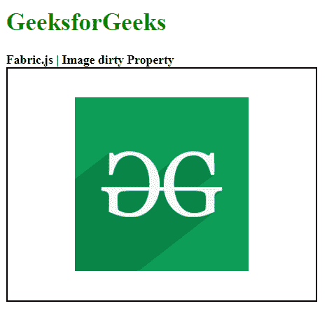

# 织物. js 图像脏属性

> 原文:[https://www . geesforgeks . org/fabric-js-image-dirty-property/](https://www.geeksforgeeks.org/fabric-js-image-dirty-property/)

在本文中，当我们将 dirty 属性设置为 true 时，对象缓存将在下一次使用 FabricJS 对 canvas Image 进行渲染调用时重新呈现。画布图像是指图像是可移动的，可以根据需要拉伸。此外，当涉及到初始笔画颜色、高度、宽度、填充颜色或笔画宽度时，可以自定义图像。

为了实现这一点，我们将使用一个名为 FabricJS 的 JavaScript 库。导入库后，我们将在包含图像的主体标签中创建一个画布块。在此之后，我们将初始化由 FabricJS 提供的 canvas 和 Image 的实例，并设置 canvas Image 的脏属性，它将在 Canvas 上呈现图像，如下例所示。

**语法**:

```html
fabric.Image(image, {
     dirty : boolean
});
```

**参数:**该属性接受如上所述的单个参数，如下所述:

*   **dirty:** 指定下次渲染调用时是否重新渲染对象缓存。

**示例**:本示例使用 FabricJS 设置画布图像的脏属性，如下例所示:

## 超文本标记语言

```html
<!DOCTYPE html> 
<html> 

<head> 
    <!-- Adding the FabricJS library -->
    <script src= 
"https://cdnjs.cloudflare.com/ajax/libs/fabric.js/3.6.2/fabric.min.js"> 
    </script> 
</head> 

<body> 
    <h1 style="color: green;"> 
        GeeksforGeeks 
    </h1> 

    <b> 
        Fabric.js | Image dirty Property 
    </b> 

    <canvas id="canvas" width="400" height="300"
        style="border:2px solid #000000"> 
    </canvas> 

     
    <br> 

    <script> 

        // Creating the instance of canvas object 
        var canvas = new fabric.Canvas("canvas"); 

        // Getting the image 
        var img = document.getElementById('my-image'); 

        // Creating the image instance 
        var geeks = new fabric.Image(img, {
            dirty : false
        }); 

        canvas.add(geeks); 
        canvas.centerObject(geeks); 
    </script> 
</body> 

</html>
```

**输出:**

