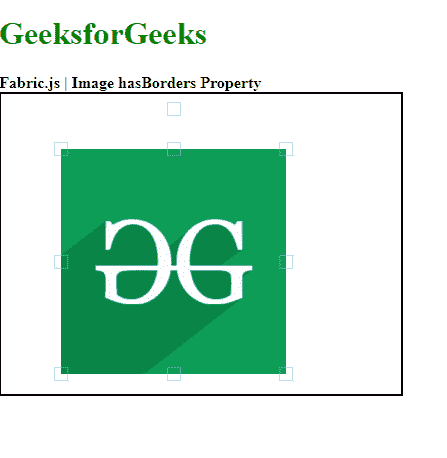

# Fabric.js 图像有边框属性

> 原文:[https://www . geesforgeks . org/fabric-js-image-hasborders-property/](https://www.geeksforgeeks.org/fabric-js-image-hasborders-property/)

**Fabric.js** 是一个用来处理画布的 JavaScript 库。画布图像是用于创建图像实例的 fabric.js 类之一。画布图像意味着图像是可移动的，可以根据需要拉伸。图像的**边框**属性用于启用或禁用画布图像的边框渲染。

**方法:**首先导入 fabric.js 库。导入库后，在主体标签中创建一个包含图像的画布块。之后，初始化一个由 Fabric 提供的 Canvas 和 image 类的实例。然后使用**的**属性来启用或禁用画布图像的边框。之后，在画布上渲染图像。

**语法:**

```
fabric.Image(image, {
    hasBorders : Boolean
});

```

**参数:**该函数取两个参数，如上所述，描述如下:

*   **图像:**该参数取图像元素。
*   **有边框:**此参数采用布尔值来启用或禁用画布上的边框渲染。

**示例:**本示例使用 FabricJS 来启用或禁用边框渲染，如下例所示。

## 超文本标记语言

```
<!DOCTYPE html> 
<html> 

<head> 
    <!-- Adding the FabricJS library -->
    <script src= 
"https://cdnjs.cloudflare.com/ajax/libs/fabric.js/3.6.2/fabric.min.js"> 
    </script> 
</head> 

<body> 
    <h1 style="color: green;">
        GeeksforGeeks
    </h1> 
    <b>
        Fabric.js | Image hasBorders  Property 
    </b>

    <canvas id="canvas" width="400" height="300"
        style="border:2px solid #000000"> 
    </canvas> 

    
    <br>

    <script> 

        // Create the instance of canvas object
        var canvas = new fabric.Canvas("canvas"); 

        // Getting the image
        var img= document.getElementById('my-image');

        // Creating the image instance 
        var imgInstance = new fabric.Image(img, {
        });

        function hasBorders (){
            imgInstance = new fabric.Image(img, {
                hasBorders : false
            });
            canvas.clear();
            // Rendering the image to canvas
            canvas.add(imgInstance);
        }
        hasBorders ();
    </script> 
</body> 

</html>
```

**输出:**

[](https://media.geeksforgeeks.org/wp-content/uploads/20200824161659/01.PNG)