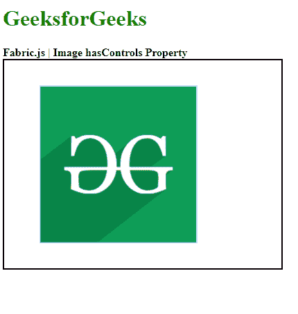

# Fabric.js Image hasControls 属性

> 原文:[https://www . geesforgeks . org/fabric-js-image-has controls-property/](https://www.geeksforgeeks.org/fabric-js-image-hascontrols-property/)

**Fabric.js** 是一个用来处理画布的 JavaScript 库。画布图像是用于创建图像实例的 fabric.js 类之一。画布图像意味着图像是可移动的，可以根据需要拉伸。图像的 **hasControls** 属性用于启用或禁用图像的控制。

**方法:**首先导入 fabric.js 库。导入库后，在主体标签中创建一个包含图像的画布块。之后，初始化一个由 Fabric 提供的 Canvas 和 image 类的实例。然后使用 **hasControls** 属性来启用或禁用画布图像的控件。在此之后，在画布上渲染图像，并单击输出图像以查看输出效果。

**语法:**

```
fabric.Image(image, {
    hascontrols : Boolean
});

```

**参数:**该函数取两个参数，如上所述，描述如下:

*   **图像:**该参数取图像元素。
*   **hasControls:** 此参数采用布尔值来启用或禁用画布图像的控制。

**示例:**本示例使用 FabricJS 禁用画布图像的控件，如下例所示。

## 超文本标记语言

```
<!DOCTYPE html> 
<html> 

<head> 
    <!-- Adding the FabricJS library -->
    <script src= 
"https://cdnjs.cloudflare.com/ajax/libs/fabric.js/3.6.2/fabric.min.js"> 
    </script> 
</head> 

<body> 
    <h1 style="color: green;">
        GeeksforGeeks
    </h1> 
    <b>
        Fabric.js | Image hasControls Property 
    </b> 

    <canvas id="canvas" width="400" height="300"
        style="border:2px solid #000000"> 
    </canvas> 

    
    <br>

    <script> 

        // Creating the instance of canvas object
        var canvas = new fabric.Canvas("canvas"); 

        // Getting the image
        var img= document.getElementById('my-image');

        // Creating the image instance 
        var imgInstance = new fabric.Image(img, {
        });

        function hasControls(){
            imgInstance = new fabric.Image(img, {
                hasControls: false
            });
            canvas.clear();
            // Rendering the image to canvas
            canvas.add(imgInstance);
        }

        hasControls();
    </script> 
</body>

</html>
```

**输出:**

[](https://media.geeksforgeeks.org/wp-content/uploads/20200824162311/01.PNG)