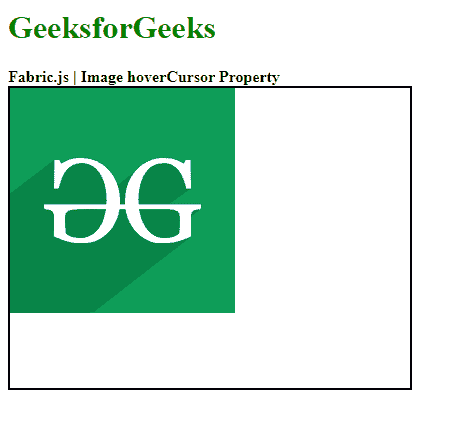

# Fabric.js 图像悬停光标属性

> 原文:[https://www . geesforgeks . org/fabric-js-image-悬停光标-property/](https://www.geeksforgeeks.org/fabric-js-image-hovercursor-property/)

Fabric.js 是一个用来处理画布的 javascript 库。画布图像是用于创建图像实例的 fabric.js 类之一。画布图像意味着图像是可移动的，可以根据需要拉伸。图像的悬停光标属性用于设置光标悬停在图像上时的样式。

**方法:**首先导入 fabric.js 库。导入库后，在主体标签中创建一个包含图像的画布块。之后，初始化一个由 Fabric 提供的 Canvas 和 image 类的实例。然后使用悬停光标属性来设置光标的样式，例如悬停在画布图像上时的指针。之后，在画布上渲染图像，并尝试将鼠标悬停在图像上。

**语法:**

```
fabric.Image(image, {
    hoverCursor:String
});

```

**参数:**该函数取两个参数，如上所述，描述如下:

*   **图像:**该参数取图像。
*   **悬停光标:**此参数采用字符串来设置光标悬停在画布图像上时的不同样式。

**示例:**本示例使用 FabricJS 设置光标悬停在画布图像上时的位置，如下例所示。

## 超文本标记语言

```
<!DOCTYPE html>
<html>

<head>

    <!-- Adding the FabricJS library -->
    <script src=
"https://cdnjs.cloudflare.com/ajax/libs/fabric.js/3.6.2/fabric.min.js">
    </script>
</head>

<body>
    <h1 style="color: green;">GeeksforGeeks</h1>

    <b>Fabric.js | Image hoverCursor Property </b>

    <canvas id="canvas" width="400" height="300" 
        style="border:2px solid #000000">
    </canvas>

    <br>

    <script>
        // Create the instance of canvas object
        var canvas = new fabric.Canvas("canvas");

        // Getting the image
        var img = document.getElementById('my-image');

        // Creating the image instance 
        var imgInstance = new fabric.Image(img, {
        });
        function hoverCursor() {
            imgInstance = new fabric.Image(img, {
                hoverCursor: "pointer"
            });
            canvas.clear();

            // Rendering the image to canvas
            canvas.add(imgInstance);
        }
        hoverCursor();
    </script>
</body>

</html>
```

**输出:**

[](#)