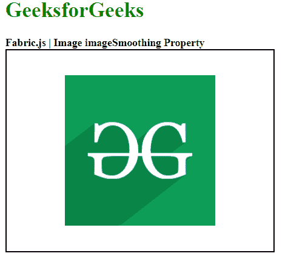

# Fabric.js 图像平滑属性

> 原文:[https://www . geesforgeks . org/fabric-js-image-image smoothing-property/](https://www.geeksforgeeks.org/fabric-js-image-imagesmoothing-property/)

**Fabric.js** 是一个用来处理画布的 JavaScript 库。**画布**是用于创建图像实例的**织物. js** 类之一。画布图像意味着图像是可移动的，可以根据需要进行拉伸。在本文中，我们将在画布图像中使用**图像平滑**属性，该属性用于定义是否应该使用图像平滑。

**接近**:首先导入 **fabric.js** 库。导入库后，在主体标签中创建一个包含图像的画布块。之后，初始化一个由 **Fabric.js** 提供的画布和图像类的实例，并使用 **imageSmoothing** 属性。之后，在画布上渲染图像。

**语法**:

```html
fabric.Image(image, {
       imageSmoothing: boolean
});
```

**参数:**该函数采用如上所述的单个参数，如下所述。

*   **图像平滑:**该参数为真时取布尔值，表示画布将使用图像平滑。

**示例**:本示例使用**fabrijs**设置画布图像的**图像平滑**属性，如下例所示。

## 超文本标记语言

```html
<!DOCTYPE html>
<html>

<head>
    <!-- Adding the FabricJS library -->
    <script src=
"https://cdnjs.cloudflare.com/ajax/libs/fabric.js/3.6.2/fabric.min.js">
    </script>
</head>

<body>
    <h1 style="color: green;">
        GeeksforGeeks
    </h1>

    <b>
        Fabric.js | Image imageSmoothing Property
    </b>

    <canvas id="canvas" width="400" height="300"
        style="border:2px solid #000000">
    </canvas>

    
    <br>

    <script>

        // Creating the instance of canvas object
        var canvas = new fabric.Canvas("canvas");

        // Getting the image
        var img = document.getElementById('my-image');

        // Creating the image instance
        var geeks = new fabric.Image(img, {
            imageSmoothing : true
        });

        canvas.add(geeks);
        canvas.centerObject(geeks);
    </script>
</body>

</html>
```

**输出:**

