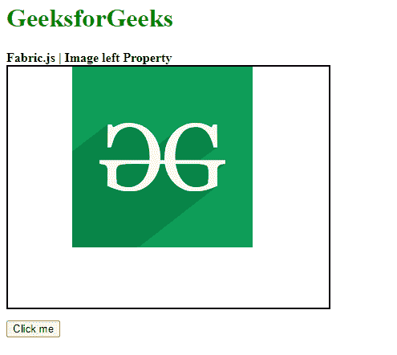
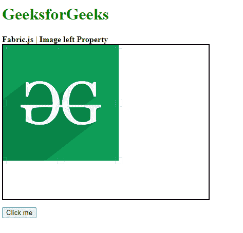

# 织物. js 图像左侧属性

> 原文:[https://www . geesforgeks . org/fabric-js-image-left-property/](https://www.geeksforgeeks.org/fabric-js-image-left-property/)

**Fabric.js** 是一个用来处理画布的 javascript 库。画布图像是用于创建图像实例的 fabric.js 类之一。画布图像意味着图像是可移动的，可以根据需要拉伸。图像的 left 属性用于设置画布图像的左侧位置。默认情况下，它相对于左侧的对象。

**方法:**首先导入 fabric.js 库。导入库后，在主体标签中创建一个包含图像的画布块。之后，初始化一个由 Fabric 提供的 Canvas 和 image 类的实例。JS，并将左边属性的数字作为参数来设置图像对象的左边位置。

**语法:**

```
fabric.Image(image, {
    left:Number
});

```

**参数:**该函数取两个参数，如上所述，描述如下:

*   **图像:**该参数取图像。
*   **左侧:**该参数取一个数字来设置对象的左侧位置。

**示例:**本示例使用 FabricJS 设置画布图像沿 x 轴的左侧位置，如下例所示。

## 超文本标记语言

```
<!DOCTYPE html> 
<html> 
<head> 

    <!-- Adding the FabricJS library -->
    <script src= 
"https://cdnjs.cloudflare.com/ajax/libs/fabric.js/3.6.2/fabric.min.js"> 
    </script> 
</head> 

<body> 
    <h1 style="color: green;">GeeksforGeeks</h1> 

    <b>Fabric.js | Image left Property </b> 

    <canvas id="canvas" width="400" height="300"
        style="border:2px solid #000000"> 
    </canvas> 

    <br>

    <button onclick="left()">Click me</button>

    <script> 

        // Create the instance of canvas object
        var canvas = new fabric.Canvas("canvas"); 
        // Getting the image
        var img= document.getElementById('my-image');
        // Creating the image instance 
        var imgInstance = new fabric.Image(img, { left:75
        });
        function left(){
            imgInstance = new fabric.Image(img, {
                left:0
            });
            canvas.clear();
            canvas.add(imgInstance);
        }
        // Rendering the image to canvas
        canvas.add(imgInstance);
    </script> 
</body> 
</html>
```

**输出:**

*   **点击按钮前:**

[](https://media.geeksforgeeks.org/wp-content/uploads/20200824145758/Capture591.png)

*   **点击按钮后:**

[](https://media.geeksforgeeks.org/wp-content/uploads/20200824145536/01163.png)