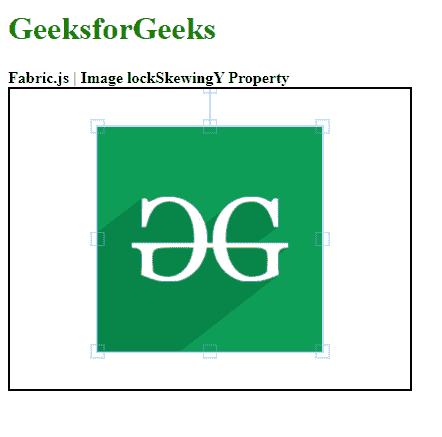

# Fabric.js Image lockSkewingY 属性

> 原文:[https://www . geesforgeks . org/fabric-js-image-lockskewingy-property/](https://www.geeksforgeeks.org/fabric-js-image-lockskewingy-property/)

Fabric.js 是一个用来处理画布的 JavaScript 库。画布图像是用于创建图像实例的 fabric.js 类之一。画布图像意味着图像是可移动的，可以根据需要拉伸。在本文中，我们将使用，lockSkewingY 属性来锁定画布图像中的垂直倾斜。

**方法:**首先导入 fabric.js 库。导入库后，在主体标签中创建一个包含图像的画布块。之后，初始化一个由 Fabric 提供的 Canvas 和 image 类的实例。JS 和使用 lockSkewingY 属性是用来锁定垂直倾斜的。之后，在画布上渲染图像。

**语法**:

```
fabric.Image(image, {
    lockSkewingY: boolean
});
```

**参数:**该函数采用如上所述的单个参数，描述如下:

*   **lockSkewingY:** 该参数取一个布尔值来锁定垂直倾斜。

**示例:**本示例使用 FabricJS 设置画布图像的 lockSkewingY 属性，如下例所示:

## 超文本标记语言

```
<!DOCTYPE html> 
<html> 

<head> 
    <!-- Adding the FabricJS library -->
    <script src= 
"https://cdnjs.cloudflare.com/ajax/libs/fabric.js/3.6.2/fabric.min.js"> 
    </script> 
</head> 

<body> 
    <h1 style="color: green;"> 
        GeeksforGeeks 
    </h1> 

    <b> 
        Fabric.js | Image lockSkewingY Property 
    </b> 

    <canvas id="canvas" width="400" height="300"
        style="border:2px solid #000000"> 
    </canvas> 

     
    <br> 

    <script> 

        // Creating the instance of canvas object 
        var canvas = new fabric.Canvas("canvas"); 

        // Getting the image 
        var img = document.getElementById('my-image'); 

        // Creating the image instance 
        var geeks = new fabric.Image(img, {
            lockSkewingY : true
        }); 

        canvas.add(geeks); 
        canvas.centerObject(geeks); 
    </script> 
</body> 

</html>
```

**输出:**

