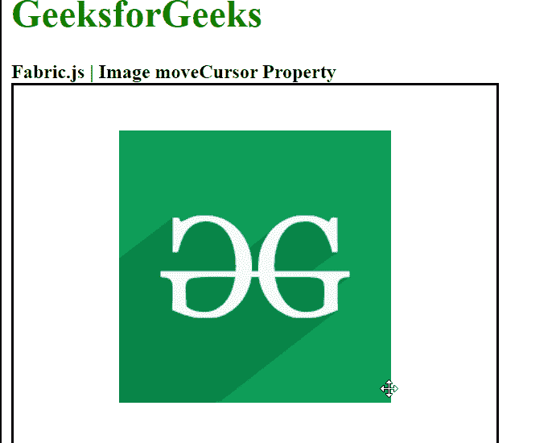

# 织物. js 图像移动光标属性

> 原文:[https://www . geesforgeks . org/fabric-js-image-move cursor-property/](https://www.geeksforgeeks.org/fabric-js-image-movecursor-property/)

**Fabric.js** 是一个用来处理画布的 JavaScript 库。画布图像是用于创建图像实例的 **fabric.js** 类之一。画布图像意味着图像是可移动的，可以根据需要进行拉伸。在本文中，我们将使用，*移动光标*属性来设置光标在画布图像中移动时的样式。

**逼近**:首先导入 **Fabric.js** 库。导入库后，在主体标签中创建一个包含图像的画布块。之后，初始化一个由 **Fabric.js** 提供的画布和图像类的实例，并使用 *moveCursor* 属性来设置移动时光标的样式。之后，在画布上渲染图像。

**语法**:

```html
fabric.Image(image, {
    moveCursor : string
});
```

**参数**:该功能取一个参数，如上所述，如下所述。

*   **移动光标**:该参数取一个字符串值来指定移动时光标的样式。

**示例**:本示例使用 **Fabric.js** 设置画布图像的 *moveCursor* 属性，如下例所示。

## 超文本标记语言

```html
<!DOCTYPE html> 
<html> 

<head> 
    <!-- Adding the FabricJS library -->
    <script src= 
"https://cdnjs.cloudflare.com/ajax/libs/fabric.js/3.6.2/fabric.min.js"> 
    </script> 
</head> 

<body> 
    <h1 style="color: green;"> 
        GeeksforGeeks 
    </h1> 

    <b> 
        Fabric.js | Image moveCursor Property 
    </b> 

    <canvas id="canvas" width="400" height="300"
        style="border:2px solid #000000"> 
    </canvas> 

     
    <br> 

    <script> 

        // Creating the instance of canvas object 
        var canvas = new fabric.Canvas("canvas"); 

        // Getting the image 
        var img = document.getElementById('my-image'); 

        // Creating the image instance 
        var geeks = new fabric.Image(img, {
            moveCursor : 'pointer' 
        }); 

        canvas.add(geeks); 
        canvas.centerObject(geeks); 
    </script> 
</body> 

</html>
```

