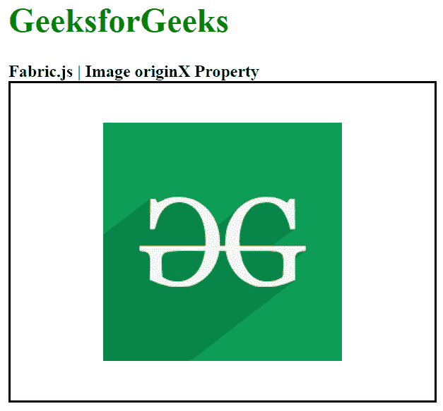

# 织物. js 图像原始属性

> 原文:[https://www . geesforgeks . org/fabric-js-image-originx-property/](https://www.geeksforgeeks.org/fabric-js-image-originx-property/)

Fabric.js 是一个用于处理画布的 JavaScript 库。画布图像是用于创建图像实例的 Fabric.js 类之一。Fabric.js 中的图像是可移动的，可以根据需要进行拉伸。在本文中，我们将使用 originX 属性来设置画布图像的水平原点。

**接近**:首先导入 Fabric.js 库。导入库后，在包含图像的主体标签中创建一个画布块。之后，初始化 Fabric.js 提供的 Canvas 和 Image 类的一个实例，使用 originX 属性设置图像的水平原点，在 Canvas 上渲染图像。

**语法**:

```html
fabric.Image(image, {
  originX : string
});
```

**参数**:该功能接受如上所述的单个参数，描述如下:

*   **originX** :指定画布图像的水平变换。

**示例**:本示例使用 Fabric.js 设置画布 Image 的 originX 属性，如下例所示:

## 超文本标记语言

```html
<html> 
<head> 
    <!-- Adding the FabricJS library -->
    <script src= 
"https://cdnjs.cloudflare.com/ajax/libs/fabric.js/3.6.2/fabric.min.js"> 
    </script> 
</head> 
<body> 
    <h1 style="color: green;"> 
        GeeksforGeeks 
    </h1> 
    <b> 
        Fabric.js | Image originX Property 
    </b> 
    <canvas id="canvas" width="400" height="300"
            style="border:2px solid #000000"> 
    </canvas> 
     
    <br> 
    <script> 
        // Creating the instance of canvas object 
        var canvas = new fabric.Canvas("canvas"); 

        // Getting the Image 
        var img = document.getElementById('my-image'); 

        // Creating the Image instance 
        var geeks = new fabric.Image(img, {
            originX:'center' 
        }); 

        canvas.add(geeks); 
        canvas.centerObject(geeks); 
    </script> 
</body> 
</html>
```

**输出:**

