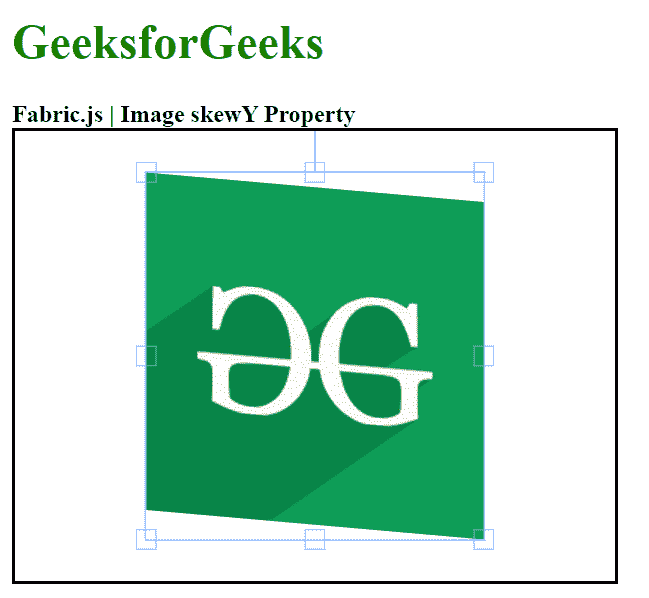

# 织物图像倾斜属性

> 原文:[https://www . geesforgeks . org/fabric-js-image-skew y-property/](https://www.geeksforgeeks.org/fabric-js-image-skewy-property/)

Fabric.js 是一个用于处理画布的 JavaScript 库。画布图像是用于创建图像实例的 fabric.js 类之一。画布图像意味着图像是可移动的，可以根据需要拉伸。在本文中，我们将使用 skyy 属性来设置垂直倾斜。

**接近**:

*   首先导入 fabric.js 库。
*   导入库后，在主体标签中创建一个包含图像的画布块。
*   之后，初始化一个由 Fabric 提供的 Canvas 和 image 类的实例。JS 并使用 skyy 属性设置垂直倾斜。
*   之后，在画布上渲染图像。

**语法:**

```html
fabric.Image(image, {
    skewY : number
});
```

**参数**:该功能取单个参数，如上所述，描述如下:

*   **偏斜**:该参数取一个数值来指定垂直偏斜

**示例**:本示例使用 FabricJS 设置画布图像的 skewY 属性，如下例所示:

## 超文本标记语言

```html
<!DOCTYPE html> 
<html> 

<head> 
    <!-- Adding the FabricJS library -->
    <script src= 
"https://cdnjs.cloudflare.com/ajax/libs/fabric.js/3.6.2/fabric.min.js"> 
    </script> 
</head> 

<body> 
    <h1 style="color: green;"> 
        GeeksforGeeks 
    </h1> 

    <b> 
        Fabric.js | Image skewY Property 
    </b> 

    <canvas id="canvas" width="400" height="300"
        style="border:2px solid #000000"> 
    </canvas> 

     
    <br> 

    <script> 

        // Creating the instance of canvas object 
        var canvas = new fabric.Canvas("canvas"); 

        // Getting the image 
        var img = document.getElementById('my-image'); 

        // Creating the image instance 
        var geeks = new fabric.Image(img, {
            skewY :5
        }); 

        canvas.add(geeks); 
        canvas.centerObject(geeks); 
    </script> 
</body> 

</html>
```

**输出:**

