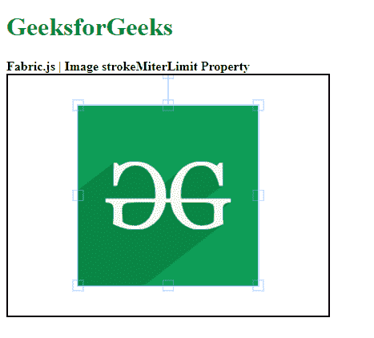

# 织物图像存储极限属性

> 原文:[https://www . geesforgeks . org/fabric-js-image-strokemiterlimit-property/](https://www.geeksforgeeks.org/fabric-js-image-strokemiterlimit-property/)

在本文中，我们将介绍如何使用 Fabric.js 设置图像的 **strokeMiterLimit** ，Fabric.js 中的图像是可移动的，可以根据需要进行拉伸。此外，当涉及到初始笔画颜色、高度、宽度、填充颜色或笔画宽度时，可以自定义图像。

为了实现这一点，我们将使用一个名为 Fabric.js 的 JavaScript 库。导入库后，我们将在主体标签中创建一个包含图像的画布块。之后，我们将初始化 Fabric.js 提供的 canvas 和 Image 的实例，并使用 **strokeMiterLimit** 属性设置 Canvas 路径的 **strokeMiterLimit** 颜色。

**语法:**

```html
fabric.Image(image, {
      strokeMiterLimit : number
});
```

**参数**:该功能取单个参数，如上所述，描述如下:

*   **strokeMiterLimit:** 该参数取一个数值来设置画布图像的 strokeMiterLimit。

**示例**:本示例使用 FabricJS 设置画布图像的 strokeMiterLimit 属性，如下例所示:

## 超文本标记语言

```html
<!DOCTYPE html> 
<html> 

<head> 
    <!-- Adding the FabricJS library -->
    <script src= 
"https://cdnjs.cloudflare.com/ajax/libs/fabric.js/3.6.2/fabric.min.js"> 
    </script> 
</head> 

<body> 
    <h1 style="color: green;"> 
        GeeksforGeeks 
    </h1> 

    <b> 
        Fabric.js | Image strokeMiterLimit Property 
    </b> 

    <canvas id="canvas" width="400" height="300"
        style="border:2px solid #000000"> 
    </canvas> 

     
    <br> 

    <script> 

        // Creating the instance of canvas object 
        var canvas = new fabric.Canvas("canvas"); 

        // Getting the image 
        var img = document.getElementById('my-image'); 

        // Creating the image instance 
        var geeks = new fabric.Image(img, {
            stroke:"green",
            strokeMiterLimit : 29,
            strokeLineJoin :"miter",
            strokeWidth:3
        }); 

        canvas.add(geeks); 
        canvas.centerObject(geeks); 
    </script> 
</body> 

</html>
```

**输出:**

