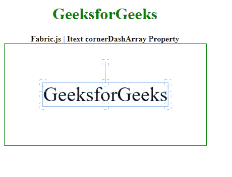

# fabric . js Itext cornerdash array 属性

> 原文:[https://www . geesforgeks . org/fabric-js-itext-cornerdasharray-property/](https://www.geeksforgeeks.org/fabric-js-itext-cornerdasharray-property/)

在本文中，我们将看到如何使用 FabricJS 设置画布 Itext 的控制角的虚线模式。Fabric.js 是一个用于处理画布的 JavaScript 库。画布 Itext 是用于创建 Itext 实例的 fabric.js 类之一。画布 Itext 是指 Itext 是可移动的，可以根据需要拉伸。在本文中，我们将使用 **cornerDashArray 属性**在画布 Itext 中设置虚线图案。

首先导入 fabric.js 库。导入库后，在主体标签中创建一个包含 Itext 的画布块。之后，初始化一个由 Fabric 提供的 Canvas 和 Itext 类的实例。JS 并使用**角点阵列属性**来设置破折号模式。

**语法**:

```html
fabric.Itext (Itext , {
            cornerDashArray : array
});
```

**参数**:该功能取单个参数，如上所述，描述如下:

*   **角数组**:该参数取一个数组值。

**示例**:本示例使用 FabricJS 设置画布 Itext 的 cornerDashArray 属性，如下例所示:

## 超文本标记语言

```html
<!DOCTYPE html>
<html>
  <head>
    <!-- FabricJS CDN -->
    <script src=
"https://cdnjs.cloudflare.com/ajax/libs/fabric.js/3.6.2/fabric.min.js">
  </script>
  </head>
  <body>
    <div style="text-align: center; width: 400px">
      <h1 style="color: green">GeeksforGeeks</h1>
      <b> Fabric.js | Itext cornerDashArray Property </b>
    </div>
    <div style="text-align: center">
      <canvas
        id="canvas"
        width="400"
        height="200"
        style="border: 1px solid green"
      >
      </canvas>
    </div>
    <script>
      var canvas = new fabric.Canvas("canvas");

      var geek = new fabric.IText("GeeksforGeeks", {
        cornerDashArray: [5],
      });
      console.log(geek.willDrawShadow());
      canvas.add(geek);
      canvas.centerObject(geek);
    </script>
  </body>
</html>
```

**输出:**

