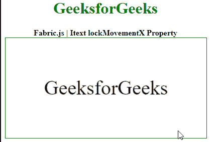

# fabric . js Itext lockmavementx 属性

> 原文:[https://www . geesforgeks . org/fabric-js-itext-lock movementx-property/](https://www.geeksforgeeks.org/fabric-js-itext-lockmovementx-property/)

**Fabric.js** 是一个用来处理画布的 JavaScript 库。*画布 Itext* 是**织物. js** 的一个类，用于创建 *Itext* 实例。*帆布 Itext* 表示 *Itext* 可移动，可根据需要拉伸。在本文中，我们将使用 *lockMovementX* 属性来锁定画布中的水平移动 *Itext* 。

**逼近**:首先导入 **Fabric.js** 库。导入库后，在主体标签中创建一个包含 *Itext* 的画布块。之后，初始化一个由 **Fabric.js** 提供的画布和 Itext 类的实例，并使用*lockmavementx*属性锁定水平移动。

**语法**:

```html
fabric.Itext(Itext, {
    lockMovementX : boolean
});
```

**参数**:该功能取一个参数，如上所述，如下所述。

*   **锁定移动**:该参数取一个布尔值来锁定水平移动。

**示例**:本示例使用 **Fabric.js** 设置画布 *Itext* 的*lockmavementx*属性，如下例所示。

## 超文本标记语言

```html
<!DOCTYPE html> 
<html> 

<head>
  <!-- FabricJS CDN -->
  <script src= 
"https://cdnjs.cloudflare.com/ajax/libs/fabric.js/3.6.2/fabric.min.js"> 
  </script> 
</head> 

<body> 
  <div style="text-align: center;width: 400px;"> 
    <h1 style="color: green;"> 
      GeeksforGeeks 
    </h1>
    <b> 
      Fabric.js | Itext lockMovementX Property 
    </b> 
  </div> 

  <div style="text-align: center;"> 
    <canvas id="canvas" width="400" height="200"
      style="border:1px solid green;"> 
    </canvas> 
  </div> 

  <script> 
    var canvas = new fabric.Canvas("canvas"); 

    var geek = new fabric.IText('GeeksforGeeks', {
        lockMovementX : true
    });
    console.log(geek.willDrawShadow())
    canvas.add(geek);
    canvas.centerObject(geek); 
  </script> 
</body> 

</html>
```

**输出:**

