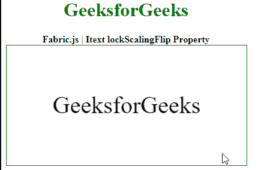

# fabric . js Itext lockscaliflip 属性

> 原文:[https://www . geesforgeks . org/fabric-js-itext-lockscalingflip-property/](https://www.geeksforgeeks.org/fabric-js-itext-lockscalingflip-property/)

在本文中，我们将看到如何通过使用 lockScalingFlip Property FabricJS 缩放画布 Itext 来锁定翻转。因此不能通过将宽度拉向负侧来反转。画布 Itext 是指 Itext 是可移动的，可以根据需要拉伸。此外，Itext 可以在初始笔画颜色、高度、宽度、填充颜色或笔画宽度方面进行自定义。

为了实现这一点，我们将使用一个名为 FabricJS 的 JavaScript 库。使用 CDN 导入库后，我们将在主体标签中创建一个画布块，其中将包含我们的 Itext。之后，我们将初始化 FabricJS 提供的 Canvas 和 Itext 的实例，并通过使用 lockScalingFlip 属性缩放 Itext 来锁定翻转，并在 Canvas 上呈现 Itext，如下例所示。

**语法**:

```html
fabric.Itext(Itext, {
      lockScalingFlip: boolean
});
```

**参数**:该功能取一个参数，如上所述，如下所述。

*   **lockscaliflip:**是一个布尔值，指定是否通过缩放来锁定翻转。

**例**:本例使用**面料。JS** 设置画布 Itext 的*lockscaliflip*属性，如下例所示。

## 超文本标记语言

```html
<!DOCTYPE html> 
<html> 

<head>
  <!-- FabricJS CDN -->
  <script src= 
"https://cdnjs.cloudflare.com/ajax/libs/fabric.js/3.6.2/fabric.min.js"> 
  </script> 
</head> 

<body> 
  <div style="text-align: center;width: 400px;"> 
    <h1 style="color: green;"> 
      GeeksforGeeks 
    </h1>
    <b> 
      Fabric.js | Itext lockScalingFlip Property 
    </b> 
  </div> 

  <div style="text-align: center;"> 
    <canvas id="canvas" width="400" height="200"
      style="border:1px solid green;"> 
    </canvas> 
  </div> 

  <script> 
    var canvas = new fabric.Canvas("canvas"); 

    var geek = new fabric.IText('GeeksforGeeks', {
        lockScalingFlip : true
    });
    console.log(geek.willDrawShadow())
    canvas.add(geek);
    canvas.centerObject(geek); 
  </script> 
</body> 

</html>
```

**输出:**

