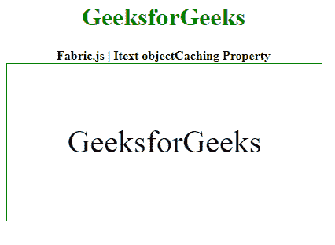

# fabric . js Itext object cache 属性

> 原文:[https://www . geesforgeks . org/fabric-js-itext-object cache-property/](https://www.geeksforgeeks.org/fabric-js-itext-objectcaching-property/)

**Fabric.js** 是一个 **JavaScript** 库，用于处理**画布**。画布 **Itext** 是用于创建 Itext 实例的 fabric.js 类之一。画布 Itext 是指 Itext 是可移动的，可以根据需要拉伸。在本文中，我们将使用**对象缓存**属性。

**接近**:首先导入 fabric.js 库。导入库后，在主体标签中创建一个包含 Itext 的画布块。之后，初始化一个由 Fabric 提供的 Canvas 和 Itext 类的实例。JS 并使用 objectCaching 属性。

**语法**:

```
fabric.Itext(Itext, {
      objectCaching : boolean
});
```

**参数**:该功能取单个参数，如上所述，描述如下:

*   **对象缓存**:该参数取布尔值

**示例**:本示例使用 FabricJS 设置画布 Itext 的 objectCaching 属性，如下例所示:

## 超文本标记语言

```
<!DOCTYPE html> 
<html> 

  <head>
    <!-- FabricJS CDN -->
    <script src= 
"https://cdnjs.cloudflare.com/ajax/libs/fabric.js/3.6.2/fabric.min.js"> 
    </script> 
  </head> 

  <body> 
    <div style="text-align: center;width: 400px;"> 
      <h1 style="color: green;"> 
        GeeksforGeeks 
      </h1>
      <b> 
        Fabric.js Itext objectCaching Property 
      </b> 
    </div> 

    <div style="text-align: center;"> 
      <canvas id="canvas" width="400" height="200"
              style="border:1px solid green;"> 
      </canvas> 
    </div> 

    <script> 
      //creating a new instance of canvas
      var canvas = new fabric.Canvas("canvas"); 
      //creating a new instance of IText
      var geek = new fabric.IText('GeeksforGeeks', {
        objectCaching : false
      });
      console.log(geek.willDrawShadow())
      //rendering IText object in canvas
      canvas.add(geek);
      canvas.centerObject(geek); 
    </script> 
  </body> 

</html>
```

**输出:**

