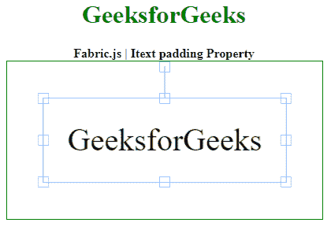

# 织物. js Itext 填充性能

> 原文:[https://www . geesforgeks . org/fabric-js-itext-padding-property/](https://www.geeksforgeeks.org/fabric-js-itext-padding-property/)

Fabric.js 是一个用于处理画布的 JavaScript 库。画布 Itext 是用于创建 Itext 实例的 fabric.js 类之一。画布 Itext 是指 Itext 是可移动的，可以根据需要拉伸。在本文中，我们将使用 padding 属性。

**方法:**首先导入 fabric.js 库。导入库后，在主体标签中创建一个包含 Itext 的画布块。之后，初始化一个由 Fabric 提供的 Canvas 和 Itext 类的实例。JS 并使用填充属性。

**语法**:

```html
fabric.Itext (Itext , {
    padding: number
});
```

**参数:**该函数采用如上所述的单个参数，描述如下:

*   **填充:**该参数取一个数值。

**示例:**本示例使用 FabricJS 设置画布 Itext 的填充属性，如下例所示:

## 超文本标记语言

```html
<!DOCTYPE html>
<html>

<head>
    <!-- FabricJS CDN -->
    <script src=
"https://cdnjs.cloudflare.com/ajax/libs/fabric.js/3.6.2/fabric.min.js">
    </script>
</head>

<body>
    <div style="text-align: center;width: 400px;">
        <h1 style="color: green;">
            GeeksforGeeks
        </h1>

        <b>
            Fabric.js | Itext padding Property
        </b>
    </div>

    <div style="text-align: center;">
        <canvas id="canvas" width="400" height="200"
            style="border:1px solid green;">
        </canvas>
    </div>

    <script>
        var canvas = new fabric.Canvas("canvas");

        var geek = new fabric.IText('GeeksforGeeks', {
            padding: '30'
        });
        console.log(geek.willDrawShadow())
        canvas.add(geek);
        canvas.centerObject(geek);
    </script>
</body>

</html>
```

**输出:**

