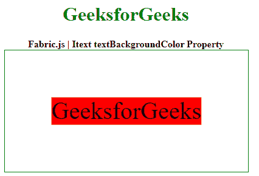

# fabric . js Itext textbackground color 属性

> 原文:[https://www . geesforgeks . org/fabric-js-itext-textbackgroundcolor-property/](https://www.geeksforgeeks.org/fabric-js-itext-textbackgroundcolor-property/)

Fabric.js 是一个用于处理画布的 JavaScript 库。画布 Itext 是用于创建 Itext 实例的 Fabric.js 类之一。画布 Itext 是指 Itext 是可移动的，可以根据需要拉伸。在本文中，我们将使用 **textBackgroundColor** 属性来设置画布 Itext 中文本行的背景颜色。

首先导入 Fabric.js 库。导入库后，在主体标签中创建一个包含 Itext 的画布块。之后，初始化 Fabric.js 提供的 Canvas 和 Itext 类的一个实例，并使用 **textBackgroundColor** 属性设置文本行的背景颜色。

**语法:**

```
fabric.Itext(Itext, {
  textBackgroundColor: string
});
```

**参数:**该函数采用如上所述的单个参数，描述如下:

*   **textBackgroundColor:** 该参数取一个字符串值。它指定要设置的背景颜色。

**示例:**在本例中，Fabric.js 用于设置画布 Itext 的 textBackgroundColor 属性。

## 超文本标记语言

```
<html>
<head>

  <!-- FabricJS CDN -->
  <script src= 
"https://cdnjs.cloudflare.com/ajax/libs/fabric.js/3.6.2/fabric.min.js"> 
  </script> 
</head> 
<body> 
  <div style="text-align: center;
              width: 400px;"> 
    <h1 style="color: green;"> 
      GeeksforGeeks 
    </h1>
    <b> 
      Fabric.js | Itext textBackgroundColor Property 
    </b> 
  </div> 
  <div style="text-align: center;"> 
    <canvas id="canvas" 
            width="400" height="200"
      style="border:1px solid green;"> 
    </canvas> 
  </div> 
  <script> 
    var canvas = new fabric.Canvas("canvas"); 

    var geek = new fabric.IText('GeeksforGeeks', {

        // Set the background color
        // of the text to "red"
        textBackgroundColor : "red"
    });

    canvas.add(geek);
    canvas.centerObject(geek); 
  </script> 
</body> 
</html>
```

**输出:**

