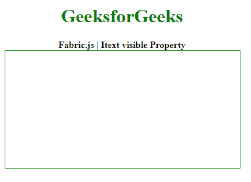
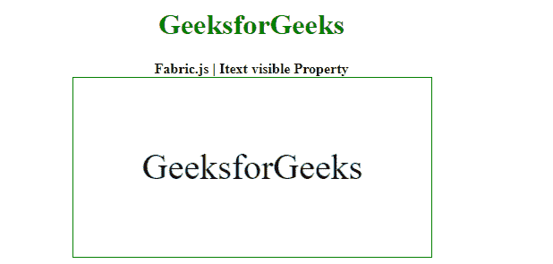

# Fabric.js Itext 可见属性

> 原文:[https://www . geesforgeks . org/fabric-js-itext-visible-property/](https://www.geeksforgeeks.org/fabric-js-itext-visible-property/)

**Fabric.js** 是一个用来处理画布的 JavaScript 库。画布 *Itext* 是 **fabric.js** 的一个类，用于创建 *Itext* 实例。画布 *Itext* 表示 Itext 是可移动的，可以根据需要拉伸。

在本文中，我们将使用*可见的*属性。

**方法:**首先导入 **fabric.js** 库。导入库后，在主体标签中创建一个包含 *Itext* 的画布块。之后，初始化画布的一个实例和 **Fabric 提供的 *Itext* 类。JS** 并使用*可见*属性。

**语法**:

```html
fabric.Itext (Itext , {
    visible: boolean
});
```

**参数:**该函数采用如上所述的单个参数，如下所述。

*   **可见:**该参数取布尔值。

**示例:**本示例使用 **FabricJS** 设置画布 *Itext* 的*可见*属性，如下例所示。

## 超文本标记语言

```html
<!DOCTYPE html> 
<html> 

<head>
  <!-- FabricJS CDN -->
  <script src= 
"https://cdnjs.cloudflare.com/ajax/libs/fabric.js/3.6.2/fabric.min.js"> 
  </script> 
</head> 

<body> 
  <div style="text-align: center;width:400px;"> 
    <h1 style="color:green;"> 
      GeeksforGeeks 
    </h1>
    <b> 
      Fabric.js | Itext visible Property 
    </b> 
  </div> 

  <div style="text-align: center;"> 
    <canvas id="canvas" width="400" height="200"
      style="border:1px solid green;"> 
    </canvas> 
  </div> 

  <script> 
    var canvas = new fabric.Canvas("canvas"); 

    var iText = new fabric.IText('GeeksforGeeks', {
            visible : false
    });
    canvas.add(iText);
    canvas.centerObject(iText); 
  </script> 
</body> 

</html>
```

**输出:**

*   当*可见*属性设置为*假*时



可见:假

*   当*可见*属性设置为*真*时



可见:真