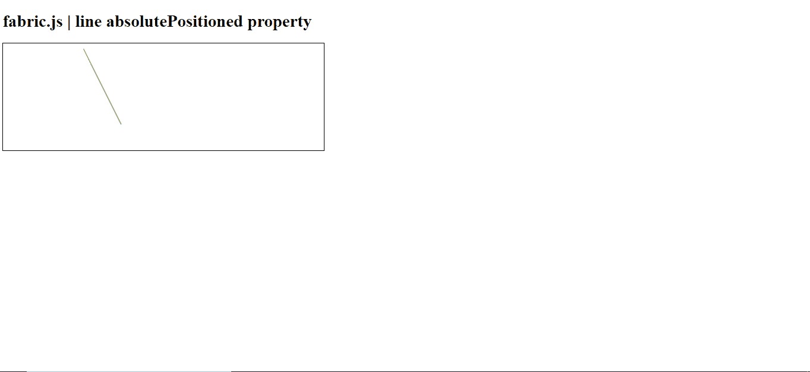

# 织物线绝对定位属性

> 原文:[https://www . geesforgeks . org/fabric-js-line-absoluteposited-property/](https://www.geeksforgeeks.org/fabric-js-line-absolutepositioned-property/)

在本文中，我们将看到如何使用 **FabricJS** 设置画布线的**绝对定位的** 属性。帆布线意味着线是可移动的，可以根据需要拉伸。此外，当涉及到初始笔画颜色、高度、宽度、填充颜色或笔画宽度时，可以自定义线条。

**语法:**

```html
fabric.line({
    absolutePositioned: boolean
});
```

**方法:**为了实现这一点，我们将使用一个名为**的 JavaScript 库。导入库之后，我们将在主体标签中创建一个画布块，它将包含行。之后，我们将初始化 **FabricJS** 提供的 canvas 和线条的实例，并使用**绝对定位** 属性设置 Canvas 线条的绝对定位，并在 Canvas 上渲染线条，如下所示。**

**参数:**该属性接受如上所述的单个参数，如下所述:

*   **绝对位置:**指定物体的绝对位置。它包含一个布尔值。

**例 1:**

## 超文本标记语言

```html
<!DOCTYPE html> 
<html> 

<head> 
   <script src= 
"https://cdnjs.cloudflare.com/ajax/libs/fabric.js/3.6.2/fabric.min.js"> 
   </script> 
</head> 

<body> 
   <h1>fabric.js | line absolutePositioned property</h1>
   <canvas id="canvas" width="600" height="200"
      style="border:1px solid #000000;"> 
   </canvas> 

   <script>  
        var canvas = new fabric.Canvas("canvas"); 
        var line = new fabric.Line([150, 10, 220, 150], { 
            stroke: 'green',
            absolutePositioned: true
        }); 
        canvas.add(line); 
   </script> 
</body>

</html>
```

**输出:**

