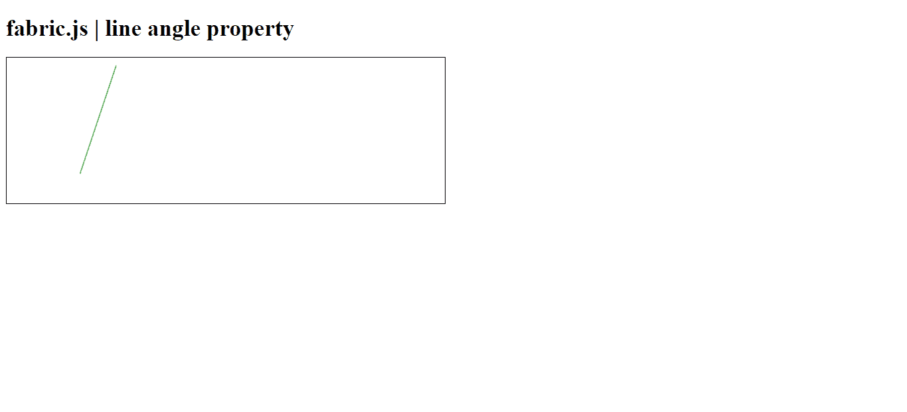
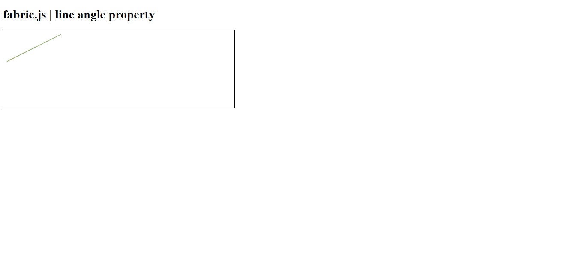

# 织物. js 线角度属性

> 原文:[https://www . geesforgeks . org/fabric-js-line-angle-property/](https://www.geeksforgeeks.org/fabric-js-line-angle-property/)

在本文中，我们将看到如何使用 **FabricJS** 设置画布线的角度。帆布线意味着线是可移动的，可以根据需要拉伸。此外，当涉及到初始笔画颜色、高度、宽度、填充颜色或笔画宽度时，可以自定义线条。

为了实现这一点，我们将使用一个名为**法布里斯**的 JavaScript 库。导入库之后，我们将在主体标签中创建一个画布块，它将包含行。之后，我们将初始化 **FabricJS** 提供的画布和线条实例，并使用 **backgroundColor** 属性更改画布线条的背景颜色，并在画布上渲染，如下例所示。

**语法:**

```html
fabric.line({
    angle: number
});
```

**参数:**该属性接受如上所述的单个参数，如下所述:

*   **角度:**此参数定义直线的角度。

**示例 1:** 该示例使用 **FabricJS** 来启用画布状线条的角度，如下所示。启用角度属性后，尝试对对象进行角度调整，它会将三角形旋转一个定义的数值。角度设置为 45 度。

## 超文本标记语言

```html
<!DOCTYPE html> 
<html> 

<head> 
   <script src= 
"https://cdnjs.cloudflare.com/ajax/libs/fabric.js/3.6.2/fabric.min.js"> 
   </script> 
</head> 

<body> 
   <h1>fabric.js | line angle property</h1>
   <canvas id="canvas" width="600" height="200"
      style="border:1px solid #000000;"> 
   </canvas> 

   <script> 
      var canvas = new fabric.Canvas("canvas"); 
      var line = new fabric.Line([150, 10, 220, 150], { 
         stroke: 'green',
         angle: 45
      }); 
      canvas.add(line); 
   </script> 
</body> 

</html>
```

**输出:**



**例 2:** 在本例中，角度设置为 90 度。

## 超文本标记语言

```html
<!DOCTYPE html> 
<html> 

<head> 
   <script src= 
"https://cdnjs.cloudflare.com/ajax/libs/fabric.js/3.6.2/fabric.min.js"> 
   </script> 
</head> 

<body> 
   <h1>fabric.js | line angle property</h1>
   <canvas id="canvas" width="600" height="200"
      style="border:1px solid #000000;"> 
   </canvas> 

   <script> 
      var canvas = new fabric.Canvas("canvas"); 
      var line = new fabric.Line([150, 10, 220, 150], { 
         stroke: 'green',
         angle: 90
      }); 
      canvas.add(line); 
   </script> 
</body> 

</html>
```

**输出:**

