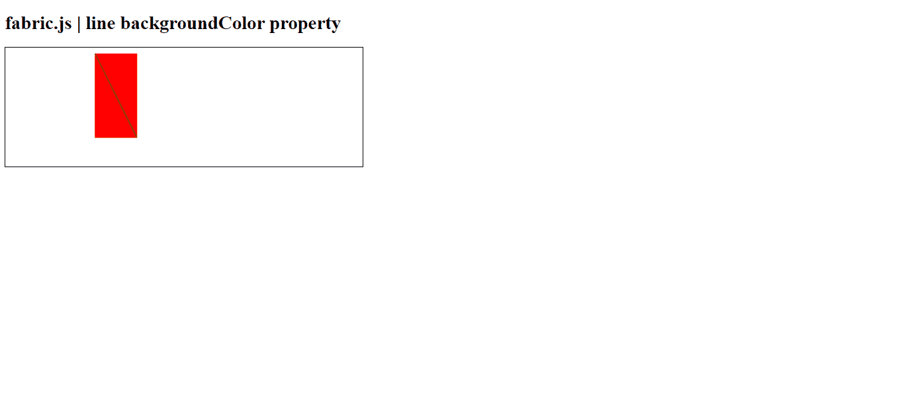

# Fabric.js 线 backgroundColor 属性

> 原文:[https://www . geesforgeks . org/fabric-js-line-background color-property/](https://www.geeksforgeeks.org/fabric-js-line-backgroundcolor-property/)

在本文中，我们将看到如何使用 **FabricJS** 改变画布线条的背景颜色。帆布线意味着线是可移动的，可以根据需要拉伸。此外，当涉及到初始笔画颜色、高度、宽度、填充颜色或笔画宽度时，可以自定义线条。

为了实现这一点，我们将使用一个名为**法布里斯**的 JavaScript 库。导入库之后，我们将在主体标签中创建一个画布块，它将包含行。之后，我们将初始化 **FabricJS** 提供的画布和线条实例，并使用 **backgroundColor** 属性更改画布线条的背景颜色，并在画布上渲染，如下例所示。

**语法:**

```html
fabric.line({
    backgroundColor : 'string'
});
```

**参数:**该属性接受如上所述的单个参数，如下所述:

*   **backgroundColor:** 是指定背景颜色的字符串。

**示例:** 本示例使用 FabricJS 更改线条画布的背景颜色。

## 超文本标记语言

```html
<!DOCTYPE html> 
<html> 

<head> 
   <script src= 
"https://cdnjs.cloudflare.com/ajax/libs/fabric.js/3.6.2/fabric.min.js"> 
   </script> 
</head> 

<body> 
   <h1>fabric.js | line backgroundColor property</h1>
   <canvas id="canvas" width="600" height="200"
      style="border:1px solid #000000;"> 
   </canvas> 

   <script> 
        var canvas = new fabric.Canvas("canvas"); 
        var line = new fabric.Line([150, 10, 220, 150], { 
            stroke: 'green',
            backgroundColor:'red'
        }); 
        canvas.add(line); 
   </script> 
</body> 

</html>
```

**输出:**

