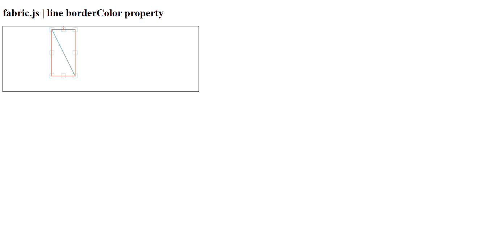

# 布艺. js 线条边框颜色属性

> 原文:[https://www . geesforgeks . org/fabric-js-line-bordercolor-property/](https://www.geeksforgeeks.org/fabric-js-line-bordercolor-property/)

在本文中，我们将看到如何使用 **FabricJS** 绘制**彩色边框**画布线画布线意味着线是可移动的，可以根据需要拉伸。此外，当涉及到初始笔画颜色、高度、宽度、填充颜色或笔画宽度时，可以自定义线条。

**语法:**

```
fabric.line({
    borderColor: 'string'
});
```

**方法:**为了实现这一点，我们将使用一个名为**的 JavaScript 库。导入库之后，我们将在主体标签中创建一个画布块，它将包含行。之后，我们将初始化 **FabricJS** 提供的画布和线条的实例，并使用 **borderColor** 属性设置画布线条的边框颜色，并在画布上渲染线条，如下所示。**

**参数:**该函数接受如上所述的单个参数，如下所述:

*   **borderColor :** 指定对象边框的颜色。它包含一个字符串值。

**示例 1:** 在本例中，我们已经将边框颜色设置为红色。

## 超文本标记语言

```
<!DOCTYPE html> 
<html> 

<head>    
   <script src= 
"https://cdnjs.cloudflare.com/ajax/libs/fabric.js/3.6.2/fabric.min.js"> 
   </script> 
</head> 

<body> 
   <h1>fabric.js | line borderColor property</h1>
   <canvas id="canvas" width="600" height="200"
      style="border:1px solid #000000;"> 
   </canvas> 

   <script>
      var canvas = new fabric.Canvas("canvas"); 

      var line = new fabric.Line([150, 10, 220, 150], { 
         stroke: 'green',
         borderColor :'red'
      }); 

      canvas.add(line); 
   </script> 
</body> 

</html> 
```

**输出:**

