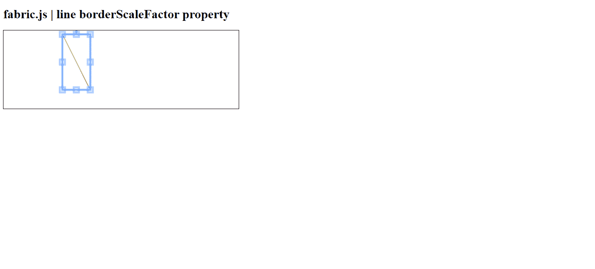

# Fabric.js 线条边界缩放因子属性

> 原文:[https://www . geeksforgeeks . org/fabric-js-line-borderscale factor-property/](https://www.geeksforgeeks.org/fabric-js-line-borderscalefactor-property/)

在本文中，我们将看到如何使用 **FabricJS** 来启用画布线的边框缩放。帆布线是指线是可移动的，可以根据需要拉伸。此外，当涉及到初始笔画颜色、高度、宽度、填充颜色或笔画宽度时，可以自定义线条。

为了实现这一点，我们将使用一个名为 **FabricJS** 的 JavaScript 库。导入库之后，我们将在主体标签中创建一个画布块，它将包含行。之后，我们将初始化**fabrijs**提供的画布和线条实例，并使用**borderscalefiler**属性启用画布线条的边框缩放，并在画布上渲染线条，如下所示。

**语法:**

```html
fabric.line({
    borderScaleFactor : Number
});
```

**参数:**该属性接受如上所述的单个参数，如下所述:

*   **边框缩放因子:**指定画布线的边框缩放。它包含一个数字值。

**示例 1:**

## 超文本标记语言

```html
<!DOCTYPE html> 
<html> 

<head> 

   <script src= 
"https://cdnjs.cloudflare.com/ajax/libs/fabric.js/3.6.2/fabric.min.js"> 
   </script> 
</head> 

<body> 
   <h1>fabric.js | line borderScaleFactor property</h1>
   <canvas id="canvas" width="600" height="200"
      style="border:1px solid #000000;"> 
   </canvas> 

   <script> 

      var canvas = new fabric.Canvas("canvas"); 

      var line = new fabric.Line([150, 10, 220, 150], { 
         stroke: 'green',
         borderScaleFactor : 5

      }); 

      canvas.add(line); 

   </script> 
</body> 

</html> 
```

**输出:**

