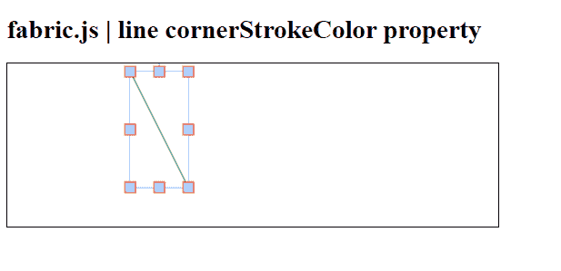

# 织物. js 线转角颜色属性

> 原文:[https://www . geesforgeks . org/fabric-js-line-cornerstrokecolor-property/](https://www.geeksforgeeks.org/fabric-js-line-cornerstrokecolor-property/)

在本文中，我们将看到如何使用 **FabricJS** 设置画布线条控制角的颜色。帆布线是指线是可移动的，可以根据需要拉伸。此外，当涉及到初始笔画颜色、高度、宽度、填充颜色或笔画宽度时，可以自定义线条。

**语法:**

```
fabric.line({
    cornerStrokeColor : string
});
```

**方法:**为了实现这一点，我们将使用一个名为**的 JavaScript 库。导入库之后，我们将在主体标签中创建一个画布块，它将包含行。之后，我们将初始化 **FabricJS** 提供的画布和线条的实例，并使用 **cornerStrokeColor** 属性设置画布线条的控制角的颜色，并在画布上渲染线条，如下所示。**

**参数:**该函数接受如上所述的单个参数，如下所述:

*   **角点颜色:**指定对象控制角点的颜色。它包含一个字符串值。

**例 1:**

## 超文本标记语言

```
<!DOCTYPE html>
<html>

<head>
    <script src=
"https://cdnjs.cloudflare.com/ajax/libs/fabric.js/3.6.2/fabric.min.js">
    </script>
</head>

<body>
    <h1>fabric.js | line cornerStrokeColor property</h1>

    <canvas id="canvas" width="600" height="200"
        style="border:1px solid #000000;"> 
    </canvas>

    <script>
        var canvas = new fabric.Canvas("canvas");

        var line = new fabric.Line([150, 10, 220, 150], {
            stroke: 'green',
            cornerStrokeColor: "red",
            transparentCorners: false
        });

        canvas.add(line);
    </script>
</body>

</html>
```

**输出:**

