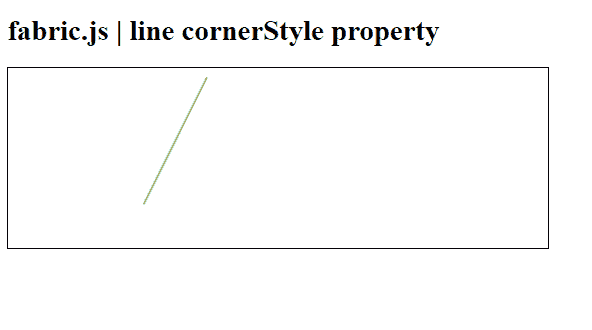
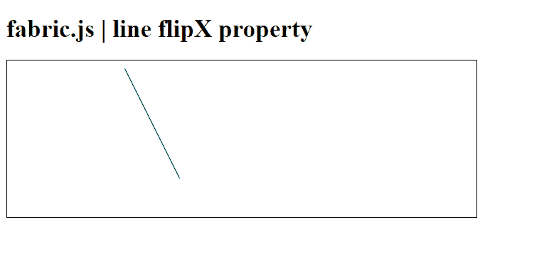

# Fabric.js 线 flipX 属性

> 原文:[https://www . geesforgeks . org/fabric-js-line-flipx-property/](https://www.geeksforgeeks.org/fabric-js-line-flipx-property/)

在本文中，我们将看到如何在 **FabricJS** 中水平翻转一条画布线。帆布线是指线是可移动的，可以根据需要拉伸。此外，当涉及到初始笔画颜色、高度、宽度、填充颜色或笔画宽度时，可以自定义线条。

**语法:**

```
fabric.line({
    flipX : boolean
});
```

**方法:**为了实现这一点，我们将使用一个名为**的 JavaScript 库。导入库之后，我们将在主体标签中创建一个画布块，它将包含行。之后，我们将初始化 **FabricJS** 和提供的画布和线条实例，使用 **flipX** 属性水平翻转画布线条，并在画布上渲染线条，如下所示。**

**参数:**该函数接受如上所述的单个参数，如下所述:

*   **flipX :** 指定如何水平翻转对象。它包含一个布尔值。

**例 1:**

## 超文本标记语言

```
<!DOCTYPE html> 
<html> 

<head> 
   <script src= 
"https://cdnjs.cloudflare.com/ajax/libs/fabric.js/3.6.2/fabric.min.js"> 
   </script> 
</head> 

<body> 
   <h1>fabric.js | line flipX  property</h1>
   <canvas id="canvas" width="600" height="200"
      style="border:1px solid #000000;"> 
   </canvas> 

   <script> 
      var canvas = new fabric.Canvas("canvas"); 

      var line = new fabric.Line([150, 10, 220, 150], { 
         stroke: 'green',
         flipX: true
      }); 

      canvas.add(line); 
   </script> 
</body> 

</html> 
```

**输出:**



**例 2:**

## 超文本标记语言

```
<!DOCTYPE html> 
<html> 

<head> 
   <script src= 
"https://cdnjs.cloudflare.com/ajax/libs/fabric.js/3.6.2/fabric.min.js"> 
   </script> 
</head> 

<body> 
   <h1>fabric.js | line flipX  property</h1>
   <canvas id="canvas" width="600" height="200"
      style="border:1px solid #000000;"> 
   </canvas> 

   <script> 
      var canvas = new fabric.Canvas("canvas"); 

      var line = new fabric.Line([150, 10, 220, 150], { 
         stroke: 'green',
         flipX: false
      }); 

      canvas.add(line); 
   </script> 
</body> 

</html> 
```

**输出:**

