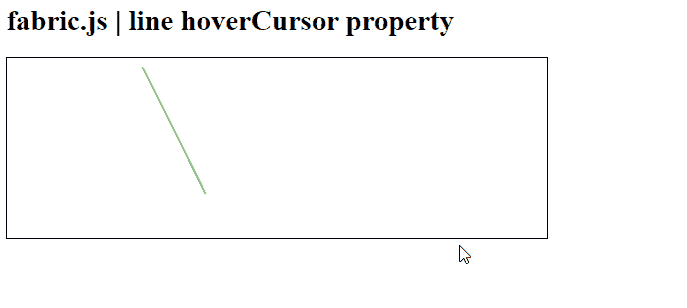
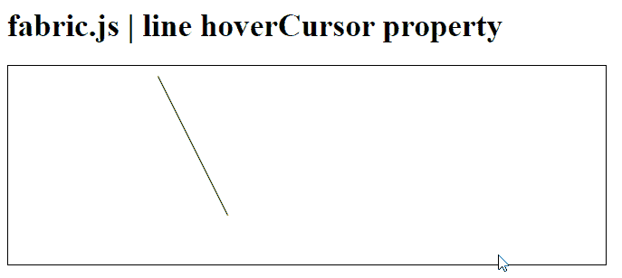

# Fabric.js 线悬停光标属性

> 原文:[https://www . geesforgeks . org/fabric-js-line-悬停光标-property/](https://www.geeksforgeeks.org/fabric-js-line-hovercursor-property/)

在本文中，我们将在 **FabricJS** 中的画布线中看到*悬停* ursor 属性。帆布线意味着线是可移动的，可以根据需要拉伸。此外，当涉及到*初始笔画颜色、高度、宽度、填充颜色、*或*笔画宽度时，可以自定义线条。*

为了实现这一点，我们将使用一个名为**的 JavaScript 库。导入库之后，我们将在主体标签中创建一个画布块，它将包含行。之后，我们将使用 ***【悬停光标】*** 属性初始化 **FabricJS** 提供的画布和线条实例以及画布线条中光标的样式，并在画布上渲染线条，如下所示。**

****语法:****

```html
fabric.line({
    hoverCursor : "string"
});
```** 

**参数:**该属性接受一个参数，如上所述，如下所述。

*   **悬停光标:**指定光标的样式。它包含一个字符串值。

**例 1:**

## 超文本标记语言

```html
<!DOCTYPE html> 
<html> 

<head> 

   <script src= 
"https://cdnjs.cloudflare.com/ajax/libs/fabric.js/3.6.2/fabric.min.js"> 
   </script> 
</head> 

<body> 
   <h1>fabric.js | line hoverCursor  property</h1>
   <canvas id="canvas" width="600" height="200"
      style="border:1px solid #000000;"> 
   </canvas> 

   <script> 

      var canvas = new fabric.Canvas("canvas"); 

      var line = new fabric.Line([150, 10, 220, 150], { 
         stroke: 'green',

      }); 

      canvas.add(line); 

   </script> 
</body> 

</html> 
```

**输出:**



**示例 2:** 以下示例演示了带有“指针”选项的*悬停光标*属性。

## 超文本标记语言

```html
<!DOCTYPE html> 
<html> 

<head> 

   <script src= 
"https://cdnjs.cloudflare.com/ajax/libs/fabric.js/3.6.2/fabric.min.js"> 
   </script> 
</head> 

<body> 
   <h1>fabric.js | line hoverCursor property</h1>
   <canvas id="canvas" width="600" height="200"
      style="border:1px solid #000000;"> 
   </canvas> 

   <script> 

      var canvas = new fabric.Canvas("canvas"); 

      var line = new fabric.Line([150, 10, 220, 150], { 
         stroke: 'green',
         hoverCursor: 'pointer'

      }); 

      canvas.add(line); 

   </script> 
</body> 

</html> 
```

**输出:**

