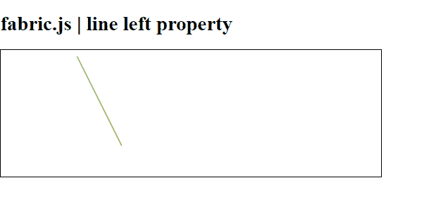
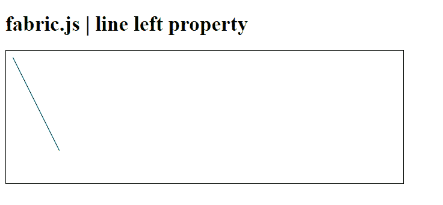

# 面料 js 线左侧属性

> 原文:[https://www.geeksforgeeks.org/fabric-js-line-left-property/](https://www.geeksforgeeks.org/fabric-js-line-left-property/)

在本文中，我们将看到如何在 **FabricJS** 中设置画布线中*相对于*向左的位置。帆布线意味着线是可移动的，可以根据需要拉伸。此外，线条可以在初始*笔画颜色、高度、宽度、填充颜色、*或*笔画宽度方面进行自定义。*

为了实现这一点，我们将使用一个名为 **FabricJS** 的 JavaScript 库。导入库之后，我们将在主体标签中创建一个画布块，它将包含行。之后，我们将初始化画布实例和**fabrijs**和提供的线，看看如何使用 **left** 属性设置画布线中相对于左侧的位置，并在画布上渲染线，如下所示。

**语法:**

```html
fabric.line({
    left : number
});
```

**参数:**该函数接受一个参数，如上所述，如下所述。

*   **左侧:**指定相对于左侧的位置*。它包含一个数值。*

**例 1:**

## 超文本标记语言

```html
<!DOCTYPE html> 
<html> 

<head> 

   <script src= 
"https://cdnjs.cloudflare.com/ajax/libs/fabric.js/3.6.2/fabric.min.js"> 
   </script> 
</head> 

<body> 
   <h1>fabric.js | line left property</h1>
   <canvas id="canvas" width="600" height="200"
      style="border:1px solid #000000;"> 
   </canvas> 

   <script> 

      var canvas = new fabric.Canvas("canvas"); 

      var line = new fabric.Line([150, 10, 220, 150], { 
         stroke: 'green',
         left : 120

      }); 

      canvas.add(line); 

   </script> 
</body> 

</html> 
```

**输出:**



**示例 2:** 在以下示例中，*左侧*属性被更改为某个新值，以使其出现在更靠近左侧的位置。

## 超文本标记语言

```html
<!DOCTYPE html> 
<html> 

<head> 

   <script src= 
"https://cdnjs.cloudflare.com/ajax/libs/fabric.js/3.6.2/fabric.min.js"> 
   </script> 
</head> 

<body> 
   <h1>fabric.js | line left property</h1>
   <canvas id="canvas" width="600" height="200"
      style="border:1px solid #000000;"> 
   </canvas> 

   <script> 

      var canvas = new fabric.Canvas("canvas"); 

      var line = new fabric.Line([150, 10, 220, 150], { 
         stroke: 'green',
         left : 10

      }); 

      canvas.add(line); 

   </script> 
</body> 

</html> 
```

**输出:**

