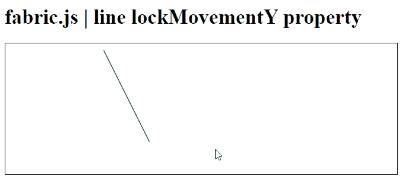
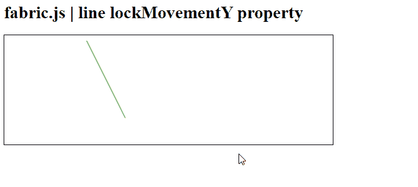

# fabric . js line lock movementy Property

> 原文:[https://www . geesforgeks . org/fabric-js-line-lock movementy-property/](https://www.geeksforgeeks.org/fabric-js-line-lockmovementy-property/)

在本文中，我们将查看设置为 true 的选项是否会在 **FabricJS** 中锁定画布线的垂直移动。帆布线是指线是可移动的，可以根据需要拉伸。 此外，线条可以自定义初始笔画颜色、高度、宽度、填充颜色或笔画宽度。

**语法:**

```
fabric.line({
    lockMovementY : boolean
});
```

**方法:** 为了实现这一点，我们将使用一个名为 **FabricJS** 的 JavaScript 库。导入库之后，我们将在主体标签中创建一个画布块，它将包含行。之后，我们将初始化 **FabricJS** 提供的画布和线条的实例，并查看设置为 true 的选项是否会使用 **lockMovementY** 属性锁定画布线条中的垂直移动，并在画布上渲染线条，如下所示。

**参数:**该函数接受如上所述的单个参数，如下所述:

*   **锁定移动:**指定如果选项设置为真，将锁定垂直移动。它包含一个布尔值。

**示例 1:**

## 超文本标记语言

```
<!DOCTYPE html> 
<html> 
<head>  
   <script src= 
    "https://cdnjs.cloudflare.com/ajax/libs/fabric.js/3.6.2/fabric.min.js"> 
   </script> 
</head> 
<body> 
   <h1>fabric.js | line lockMovementY property</h1>

   <canvas id="canvas" width="600" height="200"
      style="border:1px solid #000000;"> 
   </canvas> 

   <script>         
      // Initiate a Canvas instance 
      var canvas = new fabric.Canvas("canvas");        
      // Initiate a line instance 
      var line = new fabric.Line([150, 10, 220, 150], { 
         stroke: 'green',
         lockMovementY : true
      }); 
      // Render the line in canvas 
      canvas.add(line); 
  </script>

</body> 
</html> 
```

**输出:**



lockMovementY =真

**示例 2:**

## 超文本标记语言

```
<!DOCTYPE html> 
<html> 
<head>  
   <script src= 
    "https://cdnjs.cloudflare.com/ajax/libs/fabric.js/3.6.2/fabric.min.js"> 
   </script> 
</head> 
<body> 
   <h1>fabric.js | line lockMovementY property</h1>

   <canvas id="canvas" width="600" height="200"
      style="border:1px solid #000000;"> 
   </canvas> 

   <script>         
      // Initiate a Canvas instance 
      var canvas = new fabric.Canvas("canvas");        
      // Initiate a line instance 
      var line = new fabric.Line([150, 10, 220, 150], { 
         stroke: 'green',
         lockMovementY : false
      }); 
      // Render the line in canvas 
      canvas.add(line); 
  </script>

</body> 
</html> 
```

**输出:**



lockmovementy = false