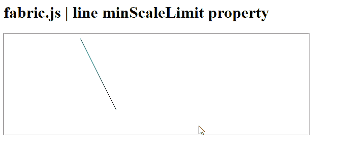
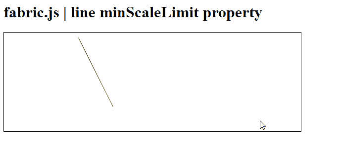

# Fabric.js 线 minScaleLimit 属性

> 原文:[https://www . geeksforgeeks . org/fabric-js-line-minscalelimit-property/](https://www.geeksforgeeks.org/fabric-js-line-minscalelimit-property/)

在本文中，我们将在 **FabricJS** 中设置画布线的最小比例限制。帆布线是指线是可移动的，可以按照要求拉伸。此外，当涉及到初始笔画颜色、高度、宽度、填充颜色或笔画宽度时，可以自定义线条。

**语法:**

```
fabric.line({
    minScaleLimit : number
});
```

**方法:**为了实现这一点，我们将使用一个名为**的 JavaScript 库。导入库之后，我们将在主体标签中创建一个画布块，它将包含行。之后，我们将初始化**fabrijs**和提供的画布和线条的实例，使用 **minScaleLimit** 属性在画布线条中设置最小比例限制，并在画布上渲染线条，如下所示。**

**参数:**该函数接受如上所述的单个参数，如下所述:

*   **明刻度极限:**指定最小刻度极限。它包含一个数值。

**示例 1:**

## 超文本标记语言

```
<!DOCTYPE html> 
<html> 

<head> 

   <script src= 
"https://cdnjs.cloudflare.com/ajax/libs/fabric.js/3.6.2/fabric.min.js"> 
   </script> 
</head> 

<body> 
   <h1>fabric.js | line minScaleLimit property</h1>
   <canvas id="canvas" width="600" height="200"
      style="border:1px solid #000000;"> 
   </canvas> 

   <script> 

      var canvas = new fabric.Canvas("canvas"); 

      var line = new fabric.Line([150, 10, 220, 150], { 
         stroke: 'green',
         minScaleLimit  : 1
      }); 

      canvas.add(line); 

   </script> 
</body> 

</html> 
```

**输出:**



**示例 2:**

## 超文本标记语言

```
<!DOCTYPE html> 
<html> 

<head> 

   <script src= 
"https://cdnjs.cloudflare.com/ajax/libs/fabric.js/3.6.2/fabric.min.js"> 
   </script> 
</head> 

<body> 
   <h1>fabric.js | line minScaleLimit property</h1>
   <canvas id="canvas" width="600" height="200"
      style="border:1px solid #000000;"> 
   </canvas> 

   <script> 

      var canvas = new fabric.Canvas("canvas"); 

      var line = new fabric.Line([150, 10, 220, 150], { 
         stroke: 'green',
         minScaleLimit  : 1.3
      }); 

      canvas.add(line); 

   </script> 
</body> 

</html> 
```

**输出:**

