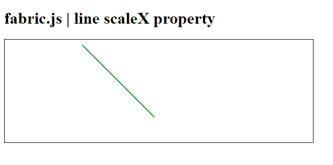

# Fabric.js Line scaleX 属性

> 原文:[https://www . geesforgeks . org/fabric-js-line-scalex-property/](https://www.geeksforgeeks.org/fabric-js-line-scalex-property/)

在本文中，我们将在 Fabric.js 中设置画布线条的水平比例。Fabric.js 中的线条是可移动的，可以根据需要进行拉伸。此外，当涉及到初始笔画颜色、高度、宽度、填充颜色或笔画宽度时，可以自定义线条。

为了实现这一点，我们将使用一个名为 Fabric.js 的 JavaScript 库。导入库后，我们将在主体标签中创建一个包含 Line 的画布块。之后，我们将初始化 Fabric.js 提供的 Canvas 和 Line 的实例，使用 **scaleX** 属性设置线条的水平比例，并在 Canvas 上渲染线条，如下所示。

**语法:**

```html
fabric.Line ({
    scaleX : number
});
```

**参数:**该属性如上所述保持单一值，如下所述:

*   **scaleX:** 它是一个指定画布线条水平比例的数值。

**例 1:**

## 超文本标记语言

```html
<!DOCTYPE html>
<html>

<head>
  <script src=
"https://cdnjs.cloudflare.com/ajax/libs/fabric.js/3.6.2/fabric.min.js">
  </script>
</head>

<body>
  <h1>fabric.js | line scaleX property</h1>

  <canvas id="canvas" width="600" height="200"
          style="border:1px solid #000000;">
  </canvas>

  <script>

    // Initialize a Canvas instance 
    var canvas = new fabric.Canvas("canvas");

    // Initialize a Line instance 
    var line = new fabric.Line([150, 10, 220, 150], {
      stroke: 'green',

      // Set the scaleX of the line
      scaleX: 3
    });

    canvas.add(line);
  </script>
</body>

</html>
```

**输出:**


**例 2:**

## 超文本标记语言

```html
<!DOCTYPE html>
<html>

<head>
  <script src=
"https://cdnjs.cloudflare.com/ajax/libs/fabric.js/3.6.2/fabric.min.js">
  </script>
</head>

<body>
  <h1>fabric.js | line scaleX property</h1>

  <canvas id="canvas" width="600" height="200" 
          style="border:1px solid #000000;">
  </canvas>

  <script>

    // Initiate a Canvas instance 
    var canvas = new fabric.Canvas("canvas");

    // Initiate a Line instance 
    var line = new fabric.Line([150, 10, 220, 150], {
      stroke: 'green',

      // Set the scaleX of the line
      scaleX: 2
    });

    canvas.add(line);
  </script>
</body>
</html>
```

**输出:**

