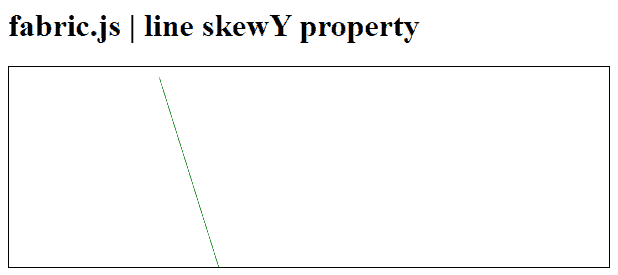

# 织物. js 线偏斜属性

> 原文:[https://www . geesforgeks . org/fabric-js-line-skew y-property/](https://www.geeksforgeeks.org/fabric-js-line-skewy-property/)

在本文中，我们将使用 **skewY** 属性来设置 **FabricJS** 中画布线的垂直倾斜。帆布线是指线是可移动的，可以根据需要拉伸。此外，当涉及到初始笔画颜色、高度、宽度、填充颜色或笔画宽度时，可以自定义线条。

为了实现这一点，我们将使用一个名为 **FabricJS** 的 JavaScript 库。导入库之后，我们将在主体标签中创建一个画布块，它将包含行。之后，我们将初始化由**fabrijs**提供的画布和线的实例，并使用 **skewY** 属性设置画布线的垂直倾斜，并在画布上渲染线，如下所示。

**语法:**

```html
fabric.line({
    skewY: number
});
```

**参数:**该属性接受如上所述的单个参数，如下所述:

*   **偏斜:**指定画布线的垂直偏斜。它包含一个数值。

**示例 1:**

## 超文本标记语言

```html
<!DOCTYPE html>
<html>

<head>

   <script src=
"https://cdnjs.cloudflare.com/ajax/libs/fabric.js/3.6.2/fabric.min.js">
   </script>
</head>

<body>
   <h1>fabric.js | line skewY property</h1>
   <canvas id="canvas" width="600" height="200"
      style="border:1px solid #000000;">
   </canvas>

   <script>

      var canvas = new fabric.Canvas("canvas");

      var line = new fabric.Line([150, 10, 220, 150], {
         stroke: 'green',
         skewY : 50
      });

      canvas.add(line);

   </script>
</body>

</html>
```

**输出:**

