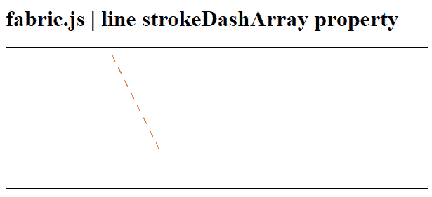

# 面料 js 线 strokeDashArray 属性

> 原文:[https://www . geesforgeks . org/fabric-js-line-strokedasharray-property/](https://www.geeksforgeeks.org/fabric-js-line-strokedasharray-property/)

在本文中，我们将使用 **strokeDashArray** 属性来在 **FabricJS** 中设置画布线条中笔画颜色的破折号图案。帆布线是指线是可移动的，可以根据需要拉伸。此外，当涉及到初始笔画颜色、高度、宽度、填充颜色或笔画宽度时，可以自定义线条。

为了实现这一点，我们将使用一个名为 **FabricJS** 的 JavaScript HTML5 画布库。导入库之后，我们将在主体标签中创建一个画布块，它将包含行。之后，我们将初始化 **FabricJS** 和提供的画布和线条的实例，使用 **strokeDashArray** 属性设置画布线条中笔画颜色的虚线图案，并在画布上渲染线条，如下所示。

**语法:**

```html
fabric.line({
    strokeDashArray : array
});
```

**参数:**该属性接受如上所述的单个参数，如下所述:

*   **strokeDashArray :** 指定画布线条中笔画颜色的破折号图案。包含一个数组值。

**示例 1:**

## 超文本标记语言

```html
<!DOCTYPE html> 
<html> 

<head> 

   <script src= 
"https://cdnjs.cloudflare.com/ajax/libs/fabric.js/3.6.2/fabric.min.js"> 
   </script> 
</head> 

<body> 
   <h1>fabric.js | line strokeDashArray property</h1>
   <canvas id="canvas" width="600" height="200"
      style="border:1px solid #000000;"> 
   </canvas> 

   <script> 

      var canvas = new fabric.Canvas("canvas"); 

      var line = new fabric.Line([150, 10, 220, 150], { 
         stroke: 'red',
         strokeDashArray: [10] 
      }); 

      canvas.add(line); 

   </script> 
</body> 

</html> 
```

**输出:**

