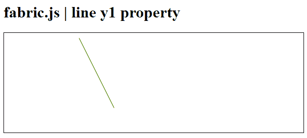
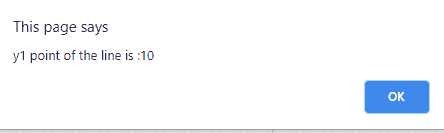

# Fabric.js 线 y1 属性

> 原文:[https://www.geeksforgeeks.org/fabric-js-line-y1-property/](https://www.geeksforgeeks.org/fabric-js-line-y1-property/)

在本文中，我们将使用 *y1* 属性来获取 **FabricJS** 中画布线的 *y1* 。帆布线意味着线是可移动的，可以根据需要拉伸。此外，对于初始笔画*颜色、高度、宽度、填充颜色、*或*笔画宽度，可以自定义线条。*

**语法:**

```html
var x = line.y1
```

**方法:**为了实现这一点，我们将使用一个名为**的 JavaScript 库。导入库之后，我们将在主体标签中创建一个画布块，它将包含行。之后，我们将初始化 **FabricJS** 提供的画布和线条的实例，并使用 *y1* 属性获取画布线条的 *y1* ，并在画布上渲染线条，如下所示。**

**参数:**该函数接受一个参数，如上所述，如下所述。

*   **y1 :** 指定画布线的 y1。它包含一个数值。

**示例:**

## 超文本标记语言

```html
<!DOCTYPE html>
<html>

<head>

   <script src=
"https://cdnjs.cloudflare.com/ajax/libs/fabric.js/3.6.2/fabric.min.js">
   </script>
</head>

<body>
   <h1>fabric.js | line y1 property</h1>
   <canvas id="canvas" width="600" height="200"
      style="border:1px solid #000000;">
   </canvas>

   <script>      

      var canvas = new fabric.Canvas("canvas");

      var line = new fabric.Line([150, 10, 220, 150], {
         stroke: 'green',
      });

      canvas.add(line);
      alert("y1 point of the line is :"+line.y1)
   </script>
</body>

</html>
```

**输出:**

 