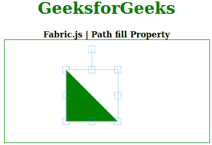

# 织物 js 路径填充属性

> 原文:[https://www.geeksforgeeks.org/fabric-js-path-fill-property/](https://www.geeksforgeeks.org/fabric-js-path-fill-property/)

在本文中，我们将看到如何使用**织物. js** 设置路径的**填充**。Fabric.js 中的路径是可移动的，可以根据需要进行拉伸。此外，当涉及到初始笔画颜色、高度、宽度、填充颜色或笔画宽度时，可以自定义路径。

**方法:**为了实现这一点，我们将使用一个名为 **Fabric.js** 的 JavaScript 库。导入库后，我们将在主体标签中创建一个包含路径的画布块。之后，我们将初始化 Fabric.js 提供的 Canvas 和 Path 的实例，并使用**填充**属性设置 canvas Path 的填充颜色。

**语法:**

```
fabric.Path('path', {
   fill: String
});
```

**参数:**该函数接受如上所述的单个参数，如下所述:

*   **填充:**指定填充形状的颜色。

以下示例说明了在 JavaScript 中使用 Fabric.js **路径填充**属性:

**示例:**

## 超文本标记语言

```
<!DOCTYPE html> 
<html> 
  <head>
    <!-- FabricJS CDN -->
    <script src= 
"https://cdnjs.cloudflare.com/ajax/libs/fabric.js/3.6.2/fabric.min.js"> 
    </script> 
  </head> 

  <body> 
    <div style="text-align: center;width: 400px;"> 
      <h1 style="color: green;"> 
        GeeksforGeeks 
      </h1>
      <b> 
        Fabric.js Path fill Property 
      </b> 
    </div> 

    <div style="text-align: center;"> 
      <canvas id="canvas" width="400" height="200"
              style="border:1px solid green;"> 
      </canvas> 
    </div> 

    <script> 
      // Initiate a Canvas instance 
      var canvas = new fabric.Canvas("canvas"); 

      var geek = new fabric.Path('M 0 0 L 100 100 L 0 100 z', {
        fill: 'green'
      });

      canvas.add(geek);
    </script> 
  </body> 

</html>
```

**输出:**

