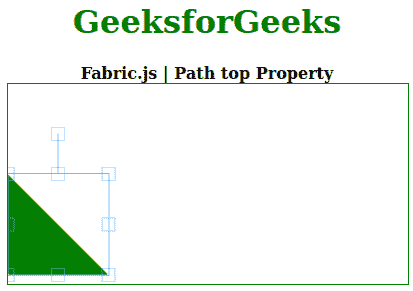

# 织物. js 路径顶部属性

> 原文:[https://www.geeksforgeeks.org/fabric-js-path-top-property/](https://www.geeksforgeeks.org/fabric-js-path-top-property/)

在本文中，我们将看到如何使用 **Fabric.js** 设置路径的*顶部*。**布艺. js** 中的路径是可移动的，可以根据需要拉伸。此外，对于初始笔划*颜色、高度、宽度、填充颜色、*或*笔划宽度，可以自定义路径。*

**方法:**为了实现这一点，我们将使用一个名为 **Fabric.js** 的 JavaScript 库。导入库后，我们将在主体标签中创建一个包含路径的画布块。之后，我们将初始化由 **Fabric.js** 提供的画布和路径的实例，以使用 *top* 属性相对于顶部定位画布路径。

**语法:**

```
fabric.Path('path', {
   top: Number;
});
```

**参数:**该函数接受一个参数，如上所述，如下所述。

*   **顶部:**指定画布路径相对于顶部的位置。

下面的例子说明了在 JavaScript 中使用 fabric . js**Path***top***T5】属性。**

**示例:**

## 超文本标记语言

```
<!DOCTYPE html> 
<html> 

<head>
  <!-- FabricJS CDN -->
  <script src= 
"https://cdnjs.cloudflare.com/ajax/libs/fabric.js/3.6.2/fabric.min.js"> 
  </script> 
</head> 

<body> 
  <div style="text-align: center;width: 400px;"> 
    <h1 style="color: green;"> 
      GeeksforGeeks 
    </h1>
    <b> 
      Fabric.js | Path top Property 
    </b> 
  </div> 

  <div style="text-align: center;"> 
    <canvas id="canvas" width="400" height="200"
      style="border:1px solid green;"> 
    </canvas> 
  </div> 

  <script> 
    // Initiate a Canvas instance 
    var canvas = new fabric.Canvas("canvas"); 

    var geek = new fabric.Path('M 0 0 L 100 100 L 0 100 z', {
      fill: 'green',
      top: 85
    });

    canvas.add(geek);
  </script> 
</body> 

</html>
```

**输出:**

