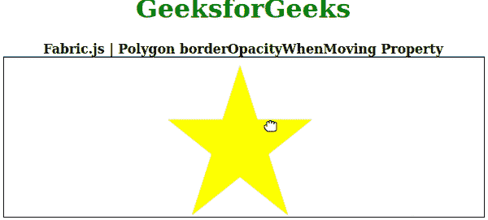
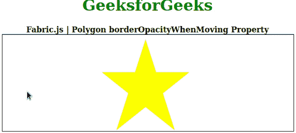

# 移动属性时的织物. js 多边形边界

> 原文:[https://www . geesforgeks . org/fabric-js-polygon-borderopacitywhen moveing-property/](https://www.geeksforgeeks.org/fabric-js-polygon-borderopacitywhenmoving-property/)

在本文中，我们将看到如何绘制一个画布多边形，当用户使用 **FabricJS** 移动多边形时，该多边形的边框不透明度将会改变。画布多边形是指多边形是可移动的，可以根据需要拉伸。此外，当涉及到初始笔画颜色、形状、填充或笔画宽度时，可以自定义多边形。

为了实现这一点，我们将使用一个名为 **FabricJS** 的 JavaScript 库。导入库之后，我们将在主体标签中创建一个包含多边形的画布块。之后，我们将初始化由 **FabricJS** 提供的画布和多边形的实例，并在使用**borderropacitywhen move**属性移动画布多边形时启用**borderropacitywhen move**，并在画布上渲染多边形，如下所示。

**语法:**

```
fabric.Polygon([ 
    { x: pixel, y: pixel }, 
    { x: pixel, y: pixel }, 
    { x: pixel, y: pixel}, 
    { x: pixel, y: pixel}, 
    { x: pixel, y: pixel }],
    {
        borderOpacityWhenMoving: number
    }
);

```

**参数:**该属性接受如上所述的单个参数，如下所述:

*   **边界多边形移动时:**此参数定义多边形的边界不透明度。

**注意:**创建多边形必须要有尺寸像素。

下面的例子说明了织物。在 JavaScript 中移动属性时，JS 多边形**边框:**

**例 1:**

## 超文本标记语言

```
<!DOCTYPE html> 
<html> 

<head> 
    <!-- Loading the FabricJS library -->
    <script src= 
"https://cdnjs.cloudflare.com/ajax/libs/fabric.js/3.6.2/fabric.min.js"> 
    </script> 
</head> 

<body> 
    <div style="text-align: center;width: 600px;"> 
        <h1 style="color: green;"> 
            GeeksforGeeks 
        </h1> 
        <b> 
            Fabric.js | Polygon borderOpacityWhenMoving Property 
        </b> 
    </div> 

    <canvas id="canvas"
            width="600"
            height="200"
            style="border:1px solid #000000;"> 
    </canvas> 

    <script> 

        // Initiate a Canvas instance 
        var canvas = new fabric.Canvas("canvas"); 

        // Initiate a polygon instance 
        var polygon = new fabric.Polygon([ 
        { x: 295, y: 10 }, 
        { x: 235, y: 198 }, 
        { x: 385, y: 78}, 
        { x: 205, y: 78}, 
        { x: 355, y: 198 }], { 
            fill: 'yellow',
            borderOpacityWhenMoving: 0.1
        }); 

        // Render the polygon in canvas 
        canvas.add(polygon); 
    </script> 
</body> 

</html>
```

**输出:**



**例 2:**

## 超文本标记语言

```
<!DOCTYPE html> 
<html> 

<head> 
    <!-- Loading the FabricJS library -->
    <script src= 
"https://cdnjs.cloudflare.com/ajax/libs/fabric.js/3.6.2/fabric.min.js"> 
    </script> 
</head> 

<body> 
    <div style="text-align: center;width: 600px;"> 
        <h1 style="color: green;"> 
            GeeksforGeeks 
        </h1> 
        <b> 
            Fabric.js | Polygon borderOpacityWhenMoving Property 
        </b> 
    </div> 

    <canvas id="canvas"
            width="600"
            height="200"
            style="border:1px solid #000000;"> 
    </canvas> 

    <script> 

        // Initiate a Canvas instance 
        var canvas = new fabric.Canvas("canvas"); 

        // Initiate a polygon instance 
        var polygon = new fabric.Polygon([ 
        { x: 295, y: 10 }, 
        { x: 235, y: 198 }, 
        { x: 385, y: 78}, 
        { x: 205, y: 78}, 
        { x: 355, y: 198 }], { 
            fill: 'yellow',
            borderOpacityWhenMoving: 1
        }); 

        // Render the polygon in canvas 
        canvas.add(polygon); 
    </script> 
</body> 

</html>
```

**输出:**

