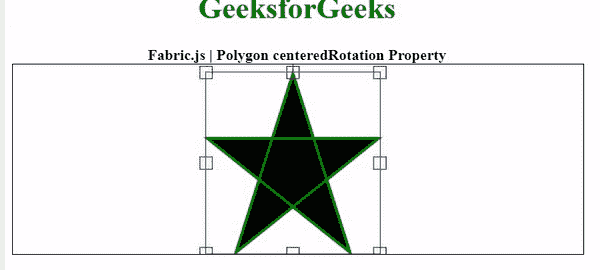

# 织物. js 多边形中心面属性

> 原文:[https://www . geeksforgeeks . org/fabric-js-polygon-centereprotation-property/](https://www.geeksforgeeks.org/fabric-js-polygon-centeredrotation-property/)

在本文中，我们将看到如何使用 **FabricJS** 设置画布多边形的居中旋转。画布意味着多边形是可移动的，可以根据需要拉伸。此外，多边形可以在初始笔画颜色、填充颜色、笔画宽度或半径方面进行自定义。

为了实现这一点，我们将使用一个名为 **FabricJS** 的 JavaScript 库。使用 CDN 导入库后，我们将在主体标签中创建一个包含我们的多边形的画布块。在此之后，我们将初始化由**fabrijs**提供的画布和多边形的实例，并使用中心面属性禁用画布多边形的中心旋转，并在画布上渲染多边形，如下例所示。

**语法:**

```
fabric.Polygon([ 
        { x: pixel, y: pixel }, 
        { x: pixel, y: pixel }, 
        { x: pixel, y: pixel}, 
        { x: pixel, y: pixel}, 
        { x: pixel, y: pixel }],
        {
                centeredRotation: boolean
        });
```

**参数:**该属性接受如上所述的单个参数，如下所述:

*   **居中旋转:**是一个布尔值，指定是启用还是禁用居中旋转。

下面的例子说明了**织物。JavaScript 中的多边形中心位置属性:**

**示例:**这里中心旋转值设置为真，因此旋转是可能的，如果为假，则不可能。

## 超文本标记语言

```
<!DOCTYPE html> 
<html> 

<head> 
    <!-- Loading the FabricJS library -->
    <script src= 
"https://cdnjs.cloudflare.com/ajax/libs/fabric.js/3.6.2/fabric.min.js"> 
    </script> 
</head> 

<body> 
    <div style="text-align: center;width: 600px;"> 
        <h1 style="color: green;"> 
            GeeksforGeeks 
        </h1> 
        <b> 
            Fabric.js | Polygon centeredRotation Property 
        </b> 
    </div> 

    <canvas id="canvas"
            width="600"
            height="200"
            style="border:1px solid #000000;"> 
    </canvas> 

    <script> 
        // Initiate a Canvas instance 
        var canvas = new fabric.Canvas("canvas"); 

        // Initiate a polygon instance 
        var polygon = new fabric.Polygon([ 
        { x: 295, y: 10 }, 
        { x: 235, y: 198 }, 
        { x: 385, y: 78}, 
        { x: 205, y: 78}, 
        { x: 355, y: 198 }], { 
            stroke: 'green',  
            strokeWidth: 3,  
            cornerColor: 'blue',  
            borderColor: 'purple',
            centeredRotation: true
        }); 

        // Render the polygon in canvas 
        canvas.add(polygon); 
    </script> 
</body> 

</html>
```

**输出:**

