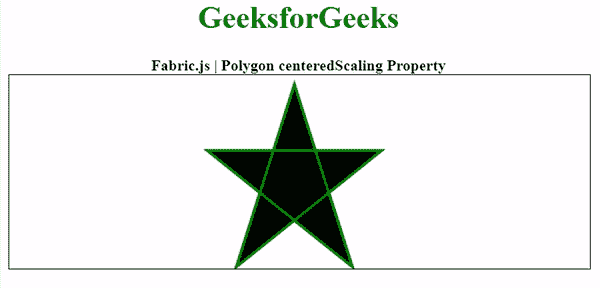

# 织物. js 多边形中心缩放属性

> 原文:[https://www . geesforgeks . org/fabric-js-polygon-centered scaling-property/](https://www.geeksforgeeks.org/fabric-js-polygon-centeredscaling-property/)

在本文中，我们将看到如何使用 **FabricJS** 启用画布多边形的居中缩放。画布多边形意味着多边形是可移动的，可以根据需要拉伸。此外，多边形可以在初始笔画颜色、高度、宽度、填充颜色或笔画宽度方面进行自定义。

为了实现这一点，我们将使用一个名为 **FabricJS** 的 JavaScript 库。导入库后，我们将在包含多边形的主体标签中创建一个画布块。之后，我们将初始化由**fabrijs**提供的画布和多边形的实例，并使用**中心缩放**属性启用画布多边形的中心缩放，并在画布上渲染多边形，如下所示。

**语法:**

```
fabric.Polygon([ 
        { x: pixel, y: pixel }, 
        { x: pixel, y: pixel }, 
        { x: pixel, y: pixel }, 
        { x: pixel, y: pixel }, 
        { x: pixel, y: pixel }],
        {
                centeredScaling: boolean
        });
```

**参数:**这些参数接受一个如上所述的参数，如下所述:

*   **居中缩放:**指定是启用还是禁用居中缩放。

**示例:**该示例使用 FabricJS 来启用下面给出的画布状多边形的居中缩放。在启用居中缩放后，尝试缩放对象，当您缩放它时，它将从四面进行缩放。

## 超文本标记语言

```
<!DOCTYPE html> 
<html> 

<head> 
    <!-- Loading the FabricJS library -->
    <script src= 
"https://cdnjs.cloudflare.com/ajax/libs/fabric.js/3.6.2/fabric.min.js"> 
    </script> 
</head> 

<body> 
    <div style="text-align: center;width: 600px;"> 
        <h1 style="color: green;"> 
            GeeksforGeeks 
        </h1> 
        <b> 
            Fabric.js | Polygon centeredScaling Property 
        </b> 
    </div> 

    <canvas id="canvas"
            width="600"
            height="200"
            style="border:1px solid #000000;"> 
    </canvas> 

    <script> 
        // Initiate a Canvas instance 
        var canvas = new fabric.Canvas("canvas"); 

        // Initiate a polygon instance 
        var polygon = new fabric.Polygon([ 
            { x: 295, y: 10 }, 
            { x: 235, y: 198 }, 
            { x: 385, y: 78}, 
            { x: 205, y: 78}, 
            { x: 355, y: 198 }], { 
                stroke: 'green', 
                strokeWidth: 3, 
                centeredScaling: true 
            }); 

        // Render the polygon in canvas 
        canvas.add(polygon); 
    </script> 
</body> 

</html>
```

**输出:**

