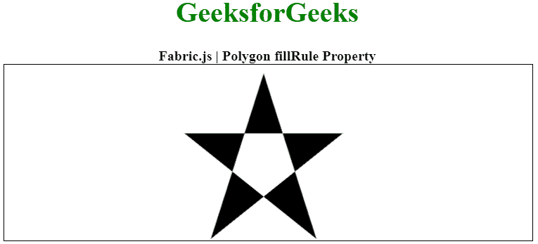
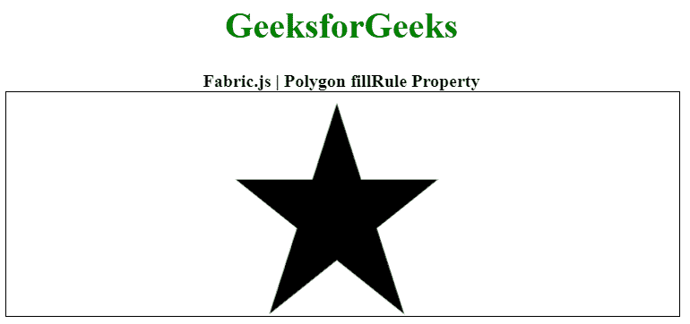

# Fabric.js 多边形填充规则属性

> 原文:[https://www . geesforgeks . org/fabric-js-polygon-fill rule-property/](https://www.geeksforgeeks.org/fabric-js-polygon-fillrule-property/)

在本文中，我们将看到如何使用 **FabricJS** 设置画布多边形的填充规则，它用于填充对象。画布多边形意味着多边形是可移动的，可以根据需要拉伸。此外，当涉及到初始笔画颜色、高度、宽度、填充颜色或笔画宽度时，可以自定义多边形。

为了实现这一点，我们将使用一个名为 **FabricJS** 的 JavaScript 库。导入库之后，我们将在主体标签中创建一个包含多边形的画布块。在此之后，我们将初始化由**fabrijs**提供的画布和多边形的实例，并使用 fill rule 属性设置画布多边形的填充规则，并在画布上渲染多边形，如下例所示。

**语法:**

```
fabric.Polygon([  
    { x: pixel, y: pixel },  
    { x: pixel, y: pixel },  
    { x: pixel, y: pixel },  
    { x: pixel, y: pixel },  
    { x: pixel, y: pixel }],
    {
        fillRule : string
    });
```

**参数:**该属性接受如上所述的单个参数，如下所述:

*   **fillRule:** 指定填充对象的规则，接受值为非零，偶数。

**注意:**创建多边形必须有尺寸像素。

以下示例说明了**织物。JavaScript 中的**多边形填充规则属性:

**示例 1:** 在本例中，我们将属性值设置为偶数。

## 超文本标记语言

```
<!DOCTYPE html> 
<html> 

<head> 
    <!-- Loading the FabricJS library -->
    <script src= 
"https://cdnjs.cloudflare.com/ajax/libs/fabric.js/3.6.2/fabric.min.js"> 
    </script> 
</head> 

<body> 
        <div style="text-align: center;width: 600px;">

        <h1 style="color: green;"> 
            GeeksforGeeks 
        </h1> 
        <b> 
            Fabric.js | Polygon fillRule Property 
        </b> 
        </div> 
    <canvas id="canvas"
            width="600"
            height="200"
            style="border:1px solid #000000;"> 
    </canvas> 

    <script> 
        // Initiate a Canvas instance 
        var canvas = new fabric.Canvas("canvas"); 

        // Initiate a polygon instance 
        var polygon = new fabric.Polygon([ 
        { x: 295, y: 10 }, 
        { x: 235, y: 198 }, 
        { x: 385, y: 78}, 
        { x: 205, y: 78}, 
        { x: 355, y: 198 }], { 
            fillRule: 'evenodd' 
        }); 

        // Render the polygon in canvas 
        canvas.add(polygon); 
    </script> 
</body> 

</html>
```

**输出:**



**例 2:** 在本例中，我们已经将属性值设置为非零。

## 超文本标记语言

```
<!DOCTYPE html> 
<html> 

<head> 
    <!-- Loading the FabricJS library -->
    <script src= 
"https://cdnjs.cloudflare.com/ajax/libs/fabric.js/3.6.2/fabric.min.js"> 
    </script> 
</head> 

<body> 
        <div style="text-align: center;width: 600px;">

        <h1 style="color: green;"> 
            GeeksforGeeks 
        </h1> 
        <b> 
            Fabric.js | Polygon fillRule Property 
        </b> 
        </div> 
    <canvas id="canvas"
            width="600"
            height="200"
            style="border:1px solid #000000;"> 
    </canvas> 

    <script> 
        // Initiate a Canvas instance 
        var canvas = new fabric.Canvas("canvas"); 

        // Initiate a polygon instance 
        var polygon = new fabric.Polygon([ 
        { x: 295, y: 10 }, 
        { x: 235, y: 198 }, 
        { x: 385, y: 78}, 
        { x: 205, y: 78}, 
        { x: 355, y: 198 }], { 
            fillRule: 'nonzero' 
        }); 

        // Render the polygon in canvas 
        canvas.add(polygon); 
    </script> 
</body> 

</html>
```

**输出:**

