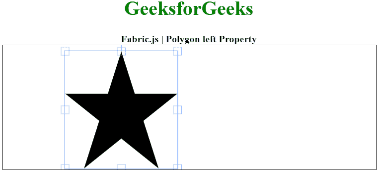

# 织物. js 多边形左侧属性

> 原文:[https://www . geesforgeks . org/fabric-js-polygon-left-property/](https://www.geeksforgeeks.org/fabric-js-polygon-left-property/)

在本文中，我们将看到如何使用 FabricJS 设置多边形画布的左侧属性。画布多边形意味着多边形是可移动的，可以根据需要拉伸。此外，多边形可以在初始笔画颜色、高度、宽度、填充颜色或笔画宽度方面进行自定义。

为了实现这一点，我们将使用一个名为 FabricJS 的 JavaScript 库。导入库之后，我们将在包含多边形的主体标签中创建一个画布块。之后，我们将初始化由 FabricJS 提供的 canvas 和 Polygon 的实例，并设置 Canvas 的 left 属性的值，然后在 Canvas 上渲染 Polygon，如下例所示。

**语法:**

```html
fabric.Polygon([
   { x: pixel, y: pixel },
   { x: pixel, y: pixel },
   { x: pixel, y: pixel},
   { x: pixel, y: pixel},
   { x: pixel, y: pixel }
],
{
   left: number
});
```

**参数:**该属性接受如上所述的单个值，如下所述:

*   **左侧:**指定对象的左侧位置。

**注意:**尺寸像素是必须创建的多边形。

下面的例子说明了织物。JavaScript 中左侧的 JS 多边形:

**示例:**

## 超文本标记语言

```html
<!DOCTYPE html> 
<html> 

<head> 

    <!-- Loading the FabricJS library -->
    <script src= 
"https://cdnjs.cloudflare.com/ajax/libs/fabric.js/3.6.2/fabric.min.js"> 
    </script> 
</head> 

<body> 
    <div style="text-align: center;width: 600px;"> 
        <h1 style="color: green;"> 
            GeeksforGeeks 
        </h1> 
        <b> 
            Fabric.js | Polygon left Property 
        </b> 
    </div> 
    <canvas id="canvas" width="600" height="200"
        style="border:1px solid #000000;"> 
    </canvas> 

    <script> 
        // Initiate a Canvas instance 
        var canvas = new fabric.Canvas("canvas"); 

        // Initiate a polygon instance 
        var polygon = new fabric.Polygon([ 
            { x: 295, y: 10 }, 
            { x: 235, y: 198 }, 
            { x: 385, y: 78 }, 
            { x: 205, y: 78 }, 
            { x: 355, y: 198 }], { 
             left: 100 

        }); 

        // Render the polygon in canvas 
        canvas.add(polygon); 
    </script> 
</body> 

</html>
```

**输出:**

