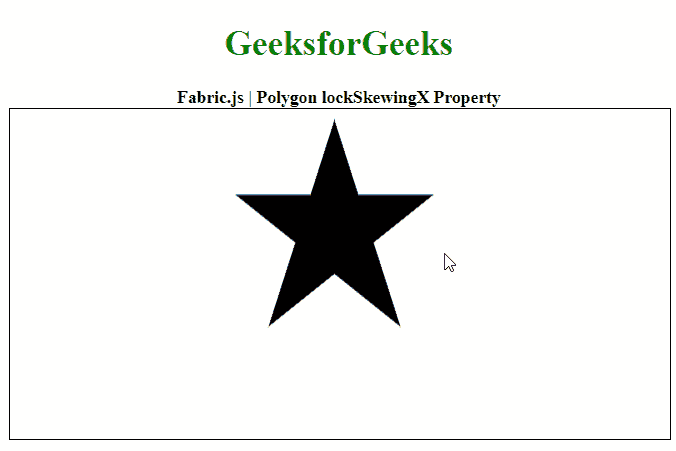

# Fabric.js 多边形 lockSkewingX 属性

> 原文:[https://www . geesforgeks . org/fabric-js-polygon-lockskewingx-property/](https://www.geeksforgeeks.org/fabric-js-polygon-lockskewingx-property/)

在本文中，我们将看到如何使用 **FabricJS** 锁定画布多边形的水平倾斜。画布多边形是指多边形是可移动的，可以根据需要拉伸。此外，当涉及到初始笔画颜色、高度、宽度、填充颜色或笔画宽度时，可以自定义多边形。

为了实现这一点，我们将使用一个名为 **FabricJS** 的 JavaScript 库。导入库之后，我们将在主体标签中创建一个包含多边形的画布块。之后，我们将初始化 **FabricJS** 提供的画布和多边形的实例，并使用 **lockSkewingX** 属性设置是否锁定画布多边形的水平倾斜。

**语法:**

```
fabric.Polygon([ 
    { x: pixel, y: pixel }, 
    { x: pixel, y: pixel }, 
    { x: pixel, y: pixel }, 
    { x: pixel, y: pixel }, 
    { x: pixel, y: pixel }],
    {
        lockSkewingX: Boolean
    }
)
```

**参数:**该属性接受如上所述的单个参数，如下所述:

*   **lockSkewingX:** 是一个布尔值，指定是否锁定画布的水平倾斜。

**注意:**尺寸像素是创建多边形的必备条件。

下面的例子说明了 JavaScript 中的**多边形 lockSkewingX 属性**:

**示例:**

## 超文本标记语言

```
<!DOCTYPE html>
<html>

<head>
    <!-- Loading the FabricJS library -->
    <script src=
"https://cdnjs.cloudflare.com/ajax/libs/fabric.js/3.6.2/fabric.min.js">
    </script>
</head>

<body>
    <div style="text-align: center;
              width: 600px;">
        <h1 style="color: green;">
            GeeksforGeeks
        </h1>
        <b>
            Fabric.js | Polygon lockSkewingX Property
        </b>
    </div>

    <canvas id="canvas" width="600" height="300" 
        style="border:1px solid #000000;">
    </canvas>

    <script>

        // Initiate a Canvas instance 
        var canvas = new fabric.Canvas("canvas");

        // Initiate a polygon instance 
        var polygon = new fabric.Polygon([
            { x: 295, y: 10 },
            { x: 235, y: 198 },
            { x: 385, y: 78 },
            { x: 205, y: 78 },
            { x: 355, y: 198 }], {

            // Disable skewing 
            // along the x-axis
            lockSkewingX: true
        });

        // Render the polygon in canvas 
        canvas.add(polygon); 
    </script>
</body>

</html>
```

**输出:**

