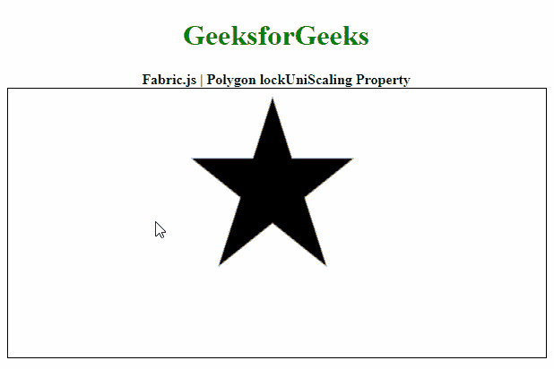

# Fabric.js |多边形锁定缩放属性

> 原文:[https://www . geesforgeks . org/fabric-js-polygon-lock uniscaling-property/](https://www.geeksforgeeks.org/fabric-js-polygon-lockuniscaling-property/)

在本文中，我们将看到如何使用 **FabricJS** 锁定画布多边形的非均匀缩放，从而保持对象的纵横比。画布多边形是指多边形是可移动的，可以根据需要拉伸。此外，当涉及到初始笔画颜色、高度、宽度、填充颜色或笔画宽度时，可以自定义多边形。

为了实现这一点，我们将使用一个名为 **FabricJS** 的 JavaScript 库。导入库之后，我们将在主体标签中创建一个包含多边形的画布块。之后，我们将初始化由**fabrijs**提供的画布和多边形的实例，并使用**锁定缩放**属性锁定画布多边形的非均匀缩放，并在画布上渲染多边形，如下例所示。

**语法:**

```
fabric.Polygon([ 
    { x: pixel, y: pixel }, 
    { x: pixel, y: pixel }, 
    { x: pixel, y: pixel }, 
    { x: pixel, y: pixel }, 
    { x: pixel, y: pixel }],
    {
                lockUniScaling: Boolean
    }
)

```

**参数:**该属性接受如上所述的单个参数，如下所述:

*   **lockUniScaling:** 是一个布尔值，指定是否锁定非均匀缩放。

**注意:**尺寸像素是创建多边形的必备条件。

以下示例说明了 JavaScript 中的**多边形锁定缩放属性**:

**示例:**

## 超文本标记语言

**输出:**

