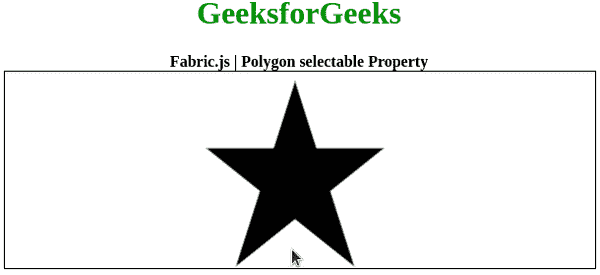
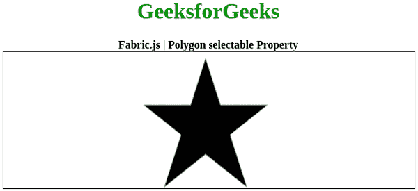

# 织物. js 多边形可选属性

> 原文:[https://www . geesforgeks . org/fabric-js-polygon-selected-property/](https://www.geeksforgeeks.org/fabric-js-polygon-selectable-property/)

在本文中，我们将看到如何使用 **FabricJS** 设置画布多边形的可选择性。画布多边形是指多边形是可移动的，可以根据需要拉伸。此外，当涉及到初始笔画颜色、形状、填充颜色或笔画宽度时，可以自定义多边形。

为了实现这一点，我们将使用一个名为 FabricJS 的 JavaScript 库。导入库之后，我们将在主体标签中创建一个包含多边形的画布块。之后，我们将初始化由 FabricJS 提供的 Canvas 和多边形的实例，并使用可选属性设置多边形的**可选择性**，并在 Canvas 上渲染多边形，如下例所示。

**语法:**

```
fabric.Polygon([ 
    { x: pixel, y: pixel }, 
    { x: pixel, y: pixel }, 
    { x: pixel, y: pixel }, 
    { x: pixel, y: pixel }, 
    { x: pixel, y: pixel }],
    {
        selectable: boolean
    }
);
```

**参数:**该属性接受如上所述的单个参数，如下所述:

*   **可选:**指定是否可选画布。

**注意:**创建多边形必须要有尺寸像素。

下面的例子说明了织物。JavaScript 中的多边形可选属性:

**示例 1:** 此处可选属性被禁用。

## 超文本标记语言

```
<!DOCTYPE html>
<html>
<head>
    <!-- Loading the FabricJS library -->
    <script src=
"https://cdnjs.cloudflare.com/ajax/libs/fabric.js/3.6.2/fabric.min.js">
    </script>
</head>

<body>
    <div style="text-align: center;width: 600px;">
        <h1 style="color: green;">
            GeeksforGeeks
        </h1>
        <b>
            Fabric.js | Polygon selectable Property
        </b>
    </div>

    <canvas id="canvas"
            width="600"
            height="200"
            style="border:1px solid #000000;">
    </canvas>

    <script>

        // Initiate a Canvas instance
        var canvas = new fabric.Canvas("canvas");

        // Initiate a polygon instance
        var polygon = new fabric.Polygon([
        { x: 295, y: 10 },
        { x: 235, y: 198 },
        { x: 385, y: 78},
        { x: 205, y: 78},
        { x: 355, y: 198 }], {
            selectable: false
        });

        // Render the polygon in canvas
        canvas.add(polygon);
    </script>
</body>

</html>
```

**输出:**



**示例 2:** 此处启用了可选属性。

## 超文本标记语言

```
<!DOCTYPE html>
<html>
<head>
    <!-- Loading the FabricJS library -->
    <script src=
"https://cdnjs.cloudflare.com/ajax/libs/fabric.js/3.6.2/fabric.min.js">
    </script>
</head>

<body>
    <div style="text-align: center;width: 600px;">
        <h1 style="color: green;">
            GeeksforGeeks
        </h1>
        <b>
            Fabric.js | Polygon selectable Property
        </b>
    </div>

    <canvas id="canvas"
            width="600"
            height="200"
            style="border:1px solid #000000;">
    </canvas>

    <script>

        // Initiate a Canvas instance
        var canvas = new fabric.Canvas("canvas");

        // Initiate a polygon instance
        var polygon = new fabric.Polygon([
        { x: 295, y: 10 },
        { x: 235, y: 198 },
        { x: 385, y: 78},
        { x: 205, y: 78},
        { x: 355, y: 198 }], {
            selectable: true
        });

        // Render the polygon in canvas
        canvas.add(polygon);
    </script>
</body>

</html>
```

**输出:**

