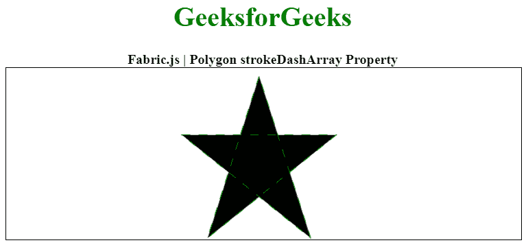

# 织物. js 多边形 strokeDashArray 属性

> 原文:[https://www . geesforgeks . org/fabric-js-polygon-strokedasharray-property/](https://www.geeksforgeeks.org/fabric-js-polygon-strokedasharray-property/)

在本文中，我们将看到如何使用 FabricJS 向多边形画布中添加一个描边虚线图案。画布意味着所写的多边形是可移动的、可旋转的、可调整大小的，并且可以拉伸。但是在本文中，我们将添加一个笔画虚线模式。此外，多边形本身不能像文本框一样编辑。

为了实现这一点，我们将使用一个名为 FabricJS 的 JavaScript 库。使用 CDN 导入库后，我们将在主体标签中创建一个包含我们的多边形的画布块。之后，我们将初始化由 FabricJS 提供的 Canvas 和 Polygon 的实例，并使用 strokeDashArray 属性创建一个笔划，并进一步使用 strokeDashArray 属性添加笔划虚线图案，并在 Polygon 上渲染 Canvas，如下例所示。

**语法:**

```
fabric.Polygon([  
    { x: pixel, y: pixel },  
    { x: pixel, y: pixel },  
    { x: pixel, y: pixel},  
    { x: pixel, y: pixel},  
    { x: pixel, y: pixel }],
    {
        strokeDashArray : Array
    }
);
```

**参数:**该属性接受单个值作为数组，如上所述，如下所述:

*   **数组:**指定笔画破折号模式。

下面的例子说明了结构:

**示例:**

## 超文本标记语言

```
<!DOCTYPE html>
<html>

<head>
    <!-- Loading the FabricJS library -->
    <script src=
"https://cdnjs.cloudflare.com/ajax/libs/fabric.js/3.6.2/fabric.min.js">
    </script>
</head>

<body>
    <div style="text-align: center;width: 600px;">
        <h1 style="color: green;">
            GeeksforGeeks
        </h1>
        <b> 
            Fabric.js | Polygon strokeDashArray Property 
        </b>
    </div>

    <canvas id="canvas" width="600" height="200" 
        style="border:1px solid #000000;"> 
    </canvas>

    <script>

        // Initiate a Canvas instance 
        var canvas = new fabric.Canvas("canvas");

        // Initiate a polygon instance 
        var polygon = new fabric.Polygon([{
            x: 295,
            y: 10
        }, {
            x: 235,
            y: 198
        }, {
            x: 385,
            y: 78
        }, {
            x: 205,
            y: 78
        }, {
            x: 355,
            y: 198
        }], {
            stroke: 'green',
            strokeDashArray: [10]
        });

        // Render the polygon in canvas 
        canvas.add(polygon);
    </script>
</body>

</html>
```

**输出:**

