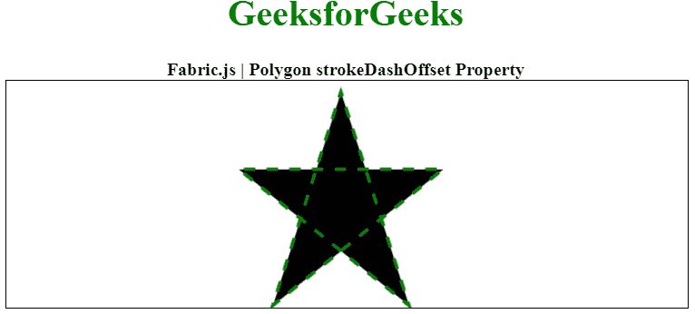

# Fabric.js 多边形 strokeDashOffset 属性

> 原文:[https://www . geesforgeks . org/fabric-js-polygon-strokedashoffset-property/](https://www.geeksforgeeks.org/fabric-js-polygon-strokedashoffset-property/)

在本文中，我们将看到如何使用 **FabricJS** 将笔画虚线偏移设置为画布多边形。画布多边形意味着多边形是可移动的，可以根据需要拉伸。此外，多边形可以在初始笔画颜色、高度、宽度、填充颜色或笔画宽度方面进行自定义。

为了实现这一点，我们将使用一个名为 **FabricJS** 的 JavaScript 库。导入库后，我们将在包含多边形的主体标签中创建一个画布块。之后，我们将初始化 **FabricJS** 提供的 Canvas 和 Polygon 的实例，并使用 *stroke* 属性创建一个笔划，并进一步使用 *strokeDashOffset* 属性添加笔划偏移，并在 Polygon 上渲染 Canvas，如下例所示。

**语法:**

```
fabric.Polygon([  
    { x: pixel, y: pixel },  
    { x: pixel, y: pixel },  
    { x: pixel, y: pixel},  
    { x: pixel, y: pixel},  
    { x: pixel, y: pixel }],
    {
        strokeDashOffset: number, 
    }
);
```

**参数:**该属性接受一个参数，如上所述，如下所述。

*   **strokeDashOffset:** 指定笔画的偏移量。

**注意:**尺寸像素必须创建多边形。

**示例:**以下示例说明了**织物。JS** 多边形*strokeDashOffset*JavaScript 中的属性。

## 超文本标记语言

```
<!DOCTYPE html>
<html>

<head>
    <!-- Loading the FabricJS library -->
    <script src=
"https://cdnjs.cloudflare.com/ajax/libs/fabric.js/3.6.2/fabric.min.js">
    </script>
</head>

<body>
    <div style="text-align: center;width: 600px;">
        <h1 style="color: green;">
            GeeksforGeeks
        </h1>
        <b> 
            Fabric.js | Polygon strokeDashOffset Property 
        </b>
    </div>

    <canvas id="canvas" width="600" height="200"
        style="border:1px solid #000000;"> 
    </canvas>

    <script>

        // Initiate a Canvas instance 
        var canvas = new fabric.Canvas("canvas");

        // Initiate a polygon instance 
        var polygon = new fabric.Polygon([{
            x: 295,
            y: 10
        }, {
            x: 235,
            y: 198
        }, {
            x: 385,
            y: 78
        }, {
            x: 205,
            y: 78
        }, {
            x: 355,
            y: 198
        }], {
            stroke: 'green',
            strokeWidth: 3,
            strokeDashArray: [10],
            strokeDashOffset: 5
        });

        // Render the polygon in canvas 
        canvas.add(polygon);
    </script>
</body>

</html>
```

**输出:**

