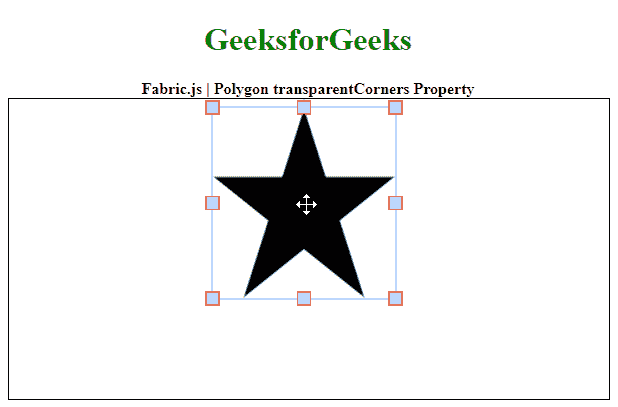
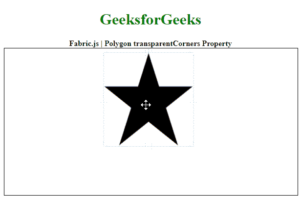

# Fabric.js 多边形透明角属性

> 原文:[https://www . geesforgeks . org/fabric-js-polygon-transparentcorners-property/](https://www.geeksforgeeks.org/fabric-js-polygon-transparentcorners-property/)

在本文中，我们将看到如何使用 **FabricJS** 设置画布多边形的角的可见性。画布意味着多边形是可移动的，可以根据需要拉伸。此外，当涉及到初始笔画颜色、填充颜色、笔画宽度或形状时，可以自定义多边形。

为了实现这一点，我们将使用一个名为 **FabricJS** 的 JavaScript 库。使用 CDN 导入库后，我们将在主体标签中创建一个画布块，它将包含我们的多边形。之后，我们将初始化 **FabricJS** 提供的画布和多边形的实例，并分别使用**透明角**属性设置多边形的角的可见性，并在画布上渲染多边形，如下例所示。

**语法:**

```
fabric.Polygon([
      { x: pixel, y: pixel },
      { x: pixel, y: pixel },
      { x: pixel, y: pixel },
      { x: pixel, y: pixel },
      { x: pixel, y: pixel }],
      {
            cornerStrokeColor: string,
            transparentCorner: boolean
      }
)

```

**参数:**该属性接受两个参数，如上所述，如下所述:

*   **角笔画颜色:**是指定控制角笔画颜色的字符串。
*   **透明角:**是一个布尔值，指定是否使控制角可见。

**注意:**尺寸像素是创建多边形的必备条件。

以下示例说明了 JavaScript 中的**多边形透明角属性**:

**示例 1:** 此处透明角落属性被禁用。

## 超文本标记语言

```
<!DOCTYPE html>
<html>
<head>
  <!-- Loading the FabricJS library -->
  <script src=
"https://cdnjs.cloudflare.com/ajax/libs/fabric.js/3.6.2/fabric.min.js">
  </script>
</head>
<body>
  <div style="text-align: center;
              width: 600px;">
    <h1 style="color: green;">
      GeeksforGeeks
    </h1>
    <b>
      Fabric.js | Polygon transparentCorners Property
    </b>
  </div>
  <canvas id="canvas" width="600" height="300"
          style="border:1px solid #000000;">
  </canvas>

  <script>

    // Initiate a Canvas instance 
    var canvas = new fabric.Canvas("canvas");

    // Initiate a polygon instance 
    var polygon = new fabric.Polygon([
      { x: 295, y: 10 },
      { x: 235, y: 198 },
      { x: 385, y: 78 },
      { x: 205, y: 78 },
      { x: 355, y: 198 }], {
      strokeWidth: 3,
      cornerStrokeColor: 'red',

      // Specify if the controlling 
      // corners are transparent
      transparentCorners: false
    });

    // Render the polygon in canvas 
    canvas.add(polygon); 
  </script>
</body>
</html>
```

**Output:**

**示例 2:** 这里启用了透明角落属性。

## 超文本标记语言

```
<!DOCTYPE html>
<html>
<head>
  <!-- Loading the FabricJS library -->
  <script src=
"https://cdnjs.cloudflare.com/ajax/libs/fabric.js/3.6.2/fabric.min.js">
  </script>
</head>
<body>
  <div style="text-align: center;
              width: 600px;">
    <h1 style="color: green;">
      GeeksforGeeks
    </h1>
    <b>
      Fabric.js | Polygon transparentCorners Property
    </b>
  </div>
  <canvas id="canvas" width="600" height="300"
          style="border:1px solid #000000;">
  </canvas>

  <script>

    // Initiate a Canvas instance 
    var canvas = new fabric.Canvas("canvas");

    // Initiate a polygon instance 
    var polygon = new fabric.Polygon([
      { x: 295, y: 10 },
      { x: 235, y: 198 },
      { x: 385, y: 78 },
      { x: 205, y: 78 },
      { x: 355, y: 198 }], {
      strokeWidth: 3,
      cornerStrokeColor: 'red',

      // Specify if the controlling 
      // corners are transparent
      transparentCorners: true
    });

    // Render the polygon in canvas 
    canvas.add(polygon); 
  </script>
</body>
</html>
```

**输出:** 