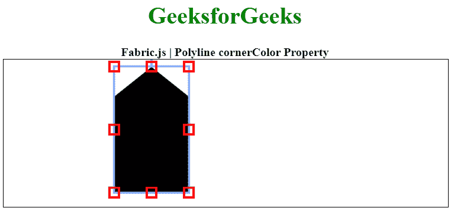

# Fabric.js 折线角颜色属性

> 原文:[https://www . geesforgeks . org/fabric-js-polyline-corner color-property/](https://www.geeksforgeeks.org/fabric-js-polyline-cornercolor-property/)

在本文中，我们将看到如何使用 FabricJS 更改画布折线的控制角颜色。画布意味着折线是可移动的，可以根据需要进行拉伸。此外，当涉及到初始笔画颜色、填充颜色、笔画宽度或半径时，可以对圆进行自定义。

为了实现这一点，我们将使用一个名为 **FabricJS** 的 JavaScript 库。使用 CDN 导入库后，我们将在主体标签中创建一个画布块，它将包含我们的折线。之后，我们将初始化由 FabricJS 提供的画布和折线实例，并使用**角颜色**属性更改折线的控制角颜色，并在画布上渲染折线，如下例所示。

**语法:**

```html
var polyline = new fabric.Polyline(Points, {  
    cornerColor: string
});  
```

**参数:**该属性接受如上所述的单个参数，如下所述:

*   **角颜色**:该参数指定控制角的颜色。

下面的例子说明了 Fabric.js 中的 cornerColor 属性:

**例**:

## 超文本标记语言

```html
<!DOCTYPE html> 
<html> 
<head> 

    <!-- Loading the FabricJS library -->
    <script src= 
"https://cdnjs.cloudflare.com/ajax/libs/fabric.js/3.6.2/fabric.min.js"> 
    </script> 
</head> 

<body> 
    <div style="text-align: center;width: 600px;"> 
        <h1 style="color: green;"> 
            GeeksforGeeks 
        </h1> 
        <b> 
            Fabric.js | Polyline cornerColor Property 
        </b> 
    </div> 

    <canvas id="canvas"
            width="600"
            height="200"
            style="border:1px solid #000000;"> 
    </canvas> 

    <script> 

        // Initiate a Canvas instance 
        var canvas = new fabric.Canvas("canvas"); 

        // Initiate a polyline instance 
        var polyline = new fabric.Polyline([ 
        { x: 200, 
            y: 10 }, 
        {x: 250, 
            y: 50 
        }, { 
            x: 250, 
            y: 180 
        }, { 
            x: 150, 
            y: 180 
        }, { 
            x: 150, 
            y: 50 
        }, { 
            x: 200, 
            y: 10 }], { 
            cornerColor: 'red',
            borderScaleFactor: 3 
        }); 

        // Render the polyline in canvas 
        canvas.add(polyline); 
    </script> 
</body> 

</html>
```

**输出:**

