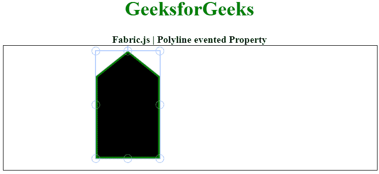

# 织物. js 折线事件属性

> 原文:[https://www . geesforgeks . org/fabric-js-polyline-event ed-property/](https://www.geeksforgeeks.org/fabric-js-polyline-evented-property/)

在本文中，我们将看到如何在 Fabric.js 中使用画布折线的事件属性。Fabric.js 中的折线是可移动的，并且可以根据需要按照 g 进行拉伸。此外，当涉及到初始笔画颜色、高度、宽度、填充颜色或笔画宽度时，可以自定义折线。此属性指定是启用还是禁用折线对象作为事件目标。

为了实现这一点，我们将使用一个名为 Fabric.js 的 JavaScript 库。导入库后，我们将在主体标签中创建一个包含折线的画布块。之后，我们将初始化 Fabric.js 提供的画布和折线实例，使用 evented 属性禁用折线的画布移动属性，并在画布上渲染折线，如下所示。

**语法:**

```
var polyline = new fabric.Polyline(Points, {  
   evented: boolean
});  
```

**参数:**该属性接受如上所述的单个参数，如下所述:

*   **evented:** 指定是启用还是禁用对象作为事件的目标。

以下示例说明了 Fabric.js 中的折线事件属性:

**示例:**

## 超文本标记语言

```
<html>
<head>
    <!-- Adding the FabricJS library -->
    <script src=
"https://cdnjs.cloudflare.com/ajax/libs/fabric.js/4.3.0/fabric.min.js">
    </script>
</head>
<body>
    <div style="text-align: center;width: 600px;">
        <h1 style="color: green;">
            GeeksforGeeks
        </h1>
        <b>
            Fabric.js | Polyline evented Property
        </b>
    </div>
    <canvas id="canvas" width="600" height="200"
            style="border:1px solid #000000;">
    </canvas>
    <script>
        // Initiate a Canvas instance 
        var canvas = new fabric.Canvas("canvas");

        // Initiate a polyline instance 
        var polyline = new fabric.Polyline([
            {
                x: 200,
                y: 10
            },
            {
                x: 250,
                y: 50
            }, {
                x: 250,
                y: 180
            }, {
                x: 150,
                y: 180
            }, {
                x: 150,
                y: 50
            }, {
                x: 200,
                y: 10
            }], {
            stroke: 'green',
            strokeWidth: 3,
            cornerStyle: 'circle',
            excludeFromExport: false,
            evented: false

        });
        // Render the polyline in canvas 
        canvas.add(polyline); 
    </script>
</body>
</html>
```

**输出:**

