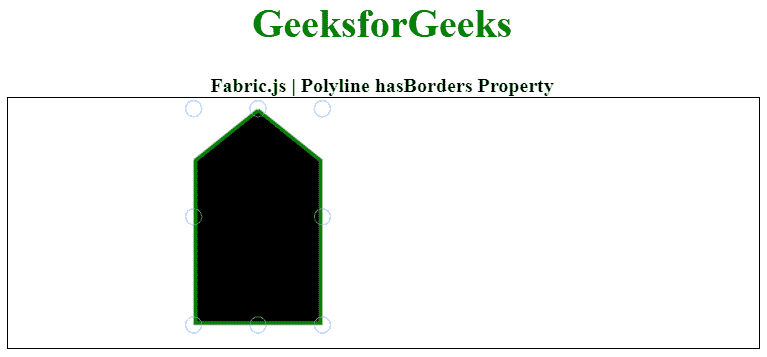
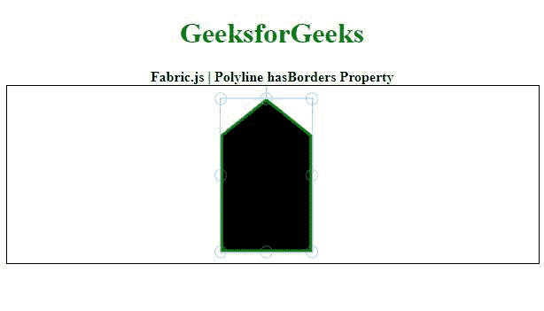

# Fabric.js 折线有边框属性

> 原文:[https://www . geesforgeks . org/fabric-js-polyline-hasborders-property/](https://www.geeksforgeeks.org/fabric-js-polyline-hasborders-property/)

画布折线意味着折线是可移动的，可以根据需要拉伸。此外，在初始笔画颜色、形状、填充颜色或笔画宽度方面，可以自定义折线。

为了设置画布折线的边框，使用了一个叫做 FabricJS 的 JavaScript 库。导入库后，我们将在包含折线的主体标记中创建一个画布块。之后，我们将初始化 FabricJS 提供的画布和折线实例，并使用 hasBorders 属性设置画布折线的边框，并在画布上渲染折线，如下例所示。

**语法:**

```
fabric.Polyline([
   { x: pixel, y: pixel },
   { x: pixel, y: pixel },
   { x: pixel, y: pixel},
   { x: pixel, y: pixel},
   { x: pixel, y: pixel }],
   { hasBorders: boolean }
);
```

**参数:**该属性接受如上所述的单个参数，如下所述:

*   **有边框:**指定边框是否可见。

**注意:** 尺寸像素是必须创建的折线。

下面的例子说明了 Fabric.js 中的 hasBorders 属性:

**示例:**

## 超文本标记语言

```
<!DOCTYPE html> 
<html> 
<head> 

    <!-- Loading the FabricJS library -->
<script src= 
"https://cdnjs.cloudflare.com/ajax/libs/fabric.js/3.6.2/fabric.min.js"> 
</script> 
</head> 

<body> 
  <div style="text-align: center;width: 600px;"> 
     <h1 style="color: green;"> 
      GeeksforGeeks 
     </h1> 
     <b> 
      Fabric.js | Polyline hasBorders Property 
    </b> 
  </div> 
    <canvas id="canvas"
      width="600"
      height="200"
      style="border:1px solid #000000;"> 
    </canvas> 

    <script> 

        // Initiate a Canvas instance 
        var canvas = new fabric.Canvas("canvas"); 

        // Initiate a polyline instance 

        var polyline = new fabric.Polyline([ 

            {x: 200, y: 10  }, 
            {x: 250, y: 50  }, 
            {x: 250, y: 180 }, 
            {x: 150, y: 180 }, 
            {x: 150, y: 50 }, 
            {x: 200, y: 10 }], 
           { 
        stroke: 'green',  
            strokeWidth: 3,  
            cornerStyle: 'circle',  
            excludeFromExport: false, 
            hasBorders: false 

        }); 

        // Render the polyline in canvas 
        canvas.add(polyline); 
    </script> 
</body> 

</html>
```

**输出:**



**示例 2:** 在本例中，hasBorders 属性设置为 true。

## java 描述语言

```
<!DOCTYPE html> 
<html> 
<head> 

    <!-- Loading the FabricJS library -->
<script src= 
"https://cdnjs.cloudflare.com/ajax/libs/fabric.js/3.6.2/fabric.min.js"> 
</script> 
</head> 

<body> 
  <div style="text-align: center;width: 600px;"> 
     <h1 style="color: green;"> 
      GeeksforGeeks 
     </h1> 
     <b> 
      Fabric.js | Polyline hasBorders Property 
    </b> 
  </div> 
    <canvas id="canvas"
      width="600"
      height="200"
      style="border:1px solid #000000;"> 
    </canvas> 

    <script> 

        // Initiate a Canvas instance 
        var canvas = new fabric.Canvas("canvas"); 

        // Initiate a polyline instance 

        var polyline = new fabric.Polyline([ 

            {x: 200, y: 10  }, 
            {x: 250, y: 50  }, 
            {x: 250, y: 180 }, 
            {x: 150, y: 180 }, 
            {x: 150, y: 50 }, 
            {x: 200, y: 10 }], 
           { 
        stroke: 'green',  
            strokeWidth: 3,  
            cornerStyle: 'circle',  
            excludeFromExport: false, 
            hasBorders: true

        }); 

        // Render the polyline in canvas 
        canvas.add(polyline); 
    </script> 
</body> 

</html>
```

**输出:**

