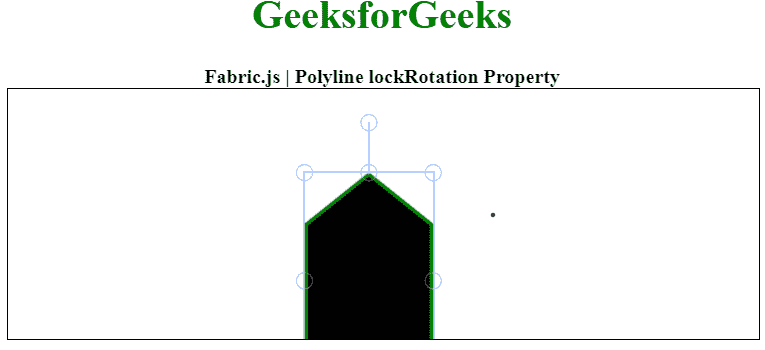

# Fabric.js 折线锁定旋转属性

> 原文:[https://www . geesforgeks . org/fabric-js-polyline-lock rotation-property/](https://www.geeksforgeeks.org/fabric-js-polyline-lockrotation-property/)

画布折线意味着折线是可移动的，可以根据需要拉伸。此外，在称为 **FabricJS 的 JavaScript 库的帮助下，当涉及到初始笔画颜色、形状、填充颜色或笔画宽度时，可以定制折线。**

**语法:**

```
var polyline = new fabric.Polyline(Points, {  
     lockRotation: boolean
});  
```

**参数:**该属性接受如上所述的单个参数，如下所述:

*   **锁定旋转:**指定是否启用旋转。

下面的例子说明了 Fabric.js 中的 lockRotation 属性。导入库后，我们将在包含折线的主体标签中创建一个画布块。之后，我们将初始化 FabricJS 提供的画布和折线实例，并使用锁定旋转属性锁定画布折线的旋转，并在画布上渲染折线。

**示例:**

## 超文本标记语言

```
<!DOCTYPE html>
<html>
<head>
  <!-- Loading the FabricJS library -->
  <script 
  src="https://cdnjs.cloudflare.com/ajax/libs/fabric.js/3.6.2/fabric.min.js">
  </script>
</head>
<body>
  <div style="text-align: center;width: 600px;">
    <h1 style="color: green;">
      GeeksforGeeks
    </h1>
    <b>Fabric.js | Polyline lockRotation Property</b>
  </div>
  <canvas id="canvas" width="600" height="200" 
  style="border:1px solid #000000;">
  </canvas>
  <script>

    // Initiate a Canvas instance 
    var canvas = new fabric.Canvas("canvas");

    // Initiate a polyline instance 
    var polyline = new fabric.Polyline([
      {
        x: 200,
        y: 10
      },
      {
        x: 250,
        y: 50
      }, {
        x: 250,
        y: 180
      }, {
        x: 150,
        y: 180
      }, {
        x: 150,
        y: 50
      }, {
        x: 200,
        y: 10
      }], {
      stroke: 'green',
      strokeWidth: 3,
      cornerStyle: 'circle',
      lockRotation: true
    });

    // Render the polyline in canvas 
    canvas.add(polyline); 
  </script>
</body>
</html>
```

**输出:**

